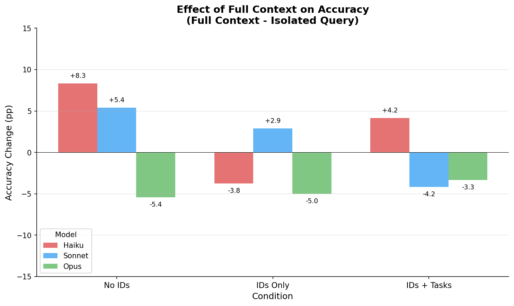

# Truthification

Research project investigating whether LLM observers can infer agent reliability through in-context learning (ICL) and determine ground truth from potentially unreliable agent statements.

## Key Research Question

**Can LLMs learn to identify which agents are reliable by observing patterns in their statements, and use this to determine ground truth?**

## Experimental Results

### Experiment 1: Isolated-Query ICL

Observer sees only statements about the queried object/property.


| Condition | Haiku | Sonnet | Opus |
|-----------|-------|--------|------|
| no_ids | 78.8% | 83.0% | 87.1% |
| ids_only | 80.4% | 83.0% | 84.6% |
| ids_and_tasks | 74.6% | **90.8%** | 87.1% |
| oracle_truth | 91.7% | 92.9% | 93.8% |

**Key finding**: Sonnet with task info (90.8%) nearly matches oracle (92.9%) - it can infer that "an agent collecting red objects claiming something isn't red = probably lying."


### Experiment 2: Full-Context ICL

Observer sees ALL 240 statements for every query, enabling reliability inference from consistency patterns.




**Key findings**:
- Haiku benefits most from full context (+8.3pp with No IDs)
- Opus degrades with more context (-5.4pp)
- Sonnet's task advantage disappears (90.8% → 86.7%)

### Complete Comparison


## Experimental Setup

### World & Agents
- **20 objects** with 4 properties: color, shape, size, value
- **3 agents** with different tasks (collect_red, collect_valuable, find_large)
- **Observer task**: "find red circles" (cares about color + shape)

### Agent Behavior (Key Innovation)
- **Adversarial agents** have consistent FALSE world models about observer-relevant properties
- They lie consistently about color/shape but tell truth about size/value
- **Cooperative agents** always truthful
- This creates detectable patterns for reliability inference

### Conditions Tested
- `no_ids`: Anonymous statements
- `ids_only`: Statements with agent IDs
- `ids_and_tasks`: IDs + task descriptions
- `oracle_reliability`: IDs + reliability percentages
- `oracle_truth_labels`: IDs + TRUE/FALSE labels

## Setup

```bash
# Install dependencies
uv sync

# Copy environment variables
cp .env.example .env
# Edit .env with your API keys (ANTHROPIC_API_KEY required)
```

## Running Experiments

```bash
# Run baseline ICL experiment
uv run python experiments/run_icl.py

# Run full-context experiment
uv run python experiments/run_icl_full_context.py

# Run context scaling experiment
uv run python experiments/run_icl_context_scaling.py

# Quick test run
uv run python experiments/run_icl.py --config-name=icl_test
```

## Project Structure

```
truthification/
├── src/
│   ├── environment/     # World, Agent, Simulation
│   ├── observer/        # ICLObserver, PromptBuilder
│   └── evaluation/      # Accuracy, ECE, Brier score
├── configs/experiment/  # Hydra configs
├── experiments/         # Experiment scripts
├── results/             # Plots and figures
└── tests/               # Unit tests
```

## Wandb

Experiments are logged to Weights & Biases:
- Project: [truthification](https://wandb.ai/thomasjiralerspong/truthification)

## Testing

```bash
uv run pytest
```
