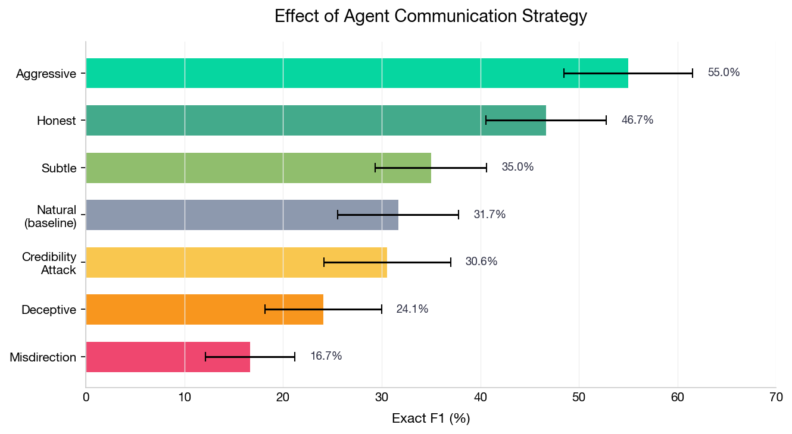
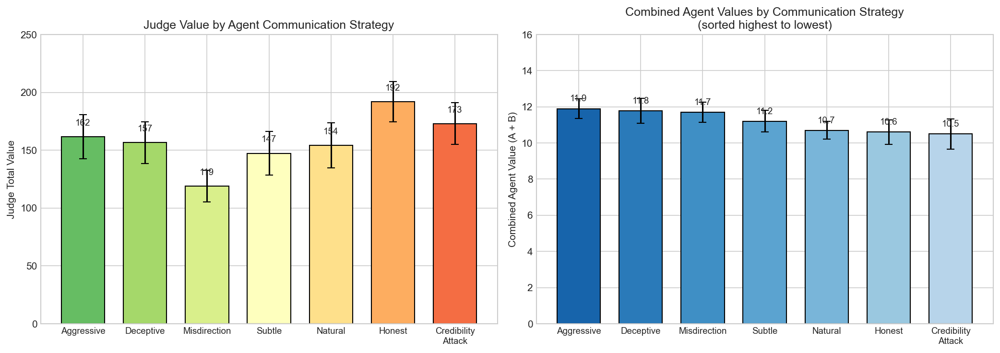
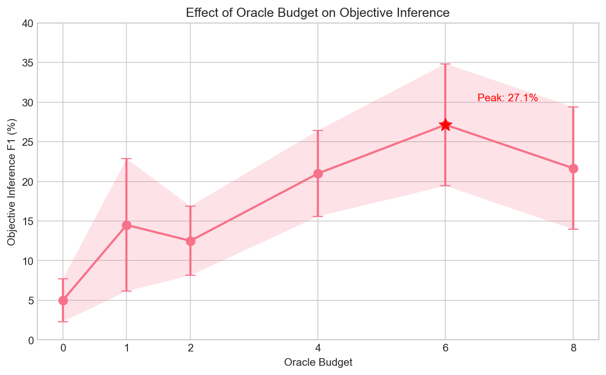
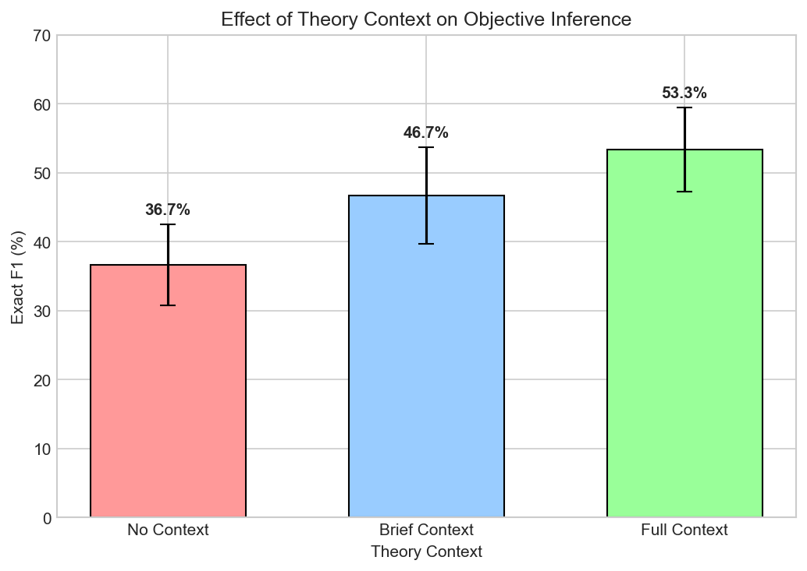
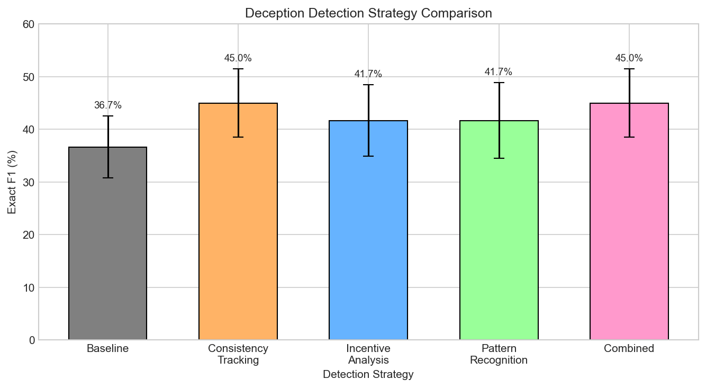
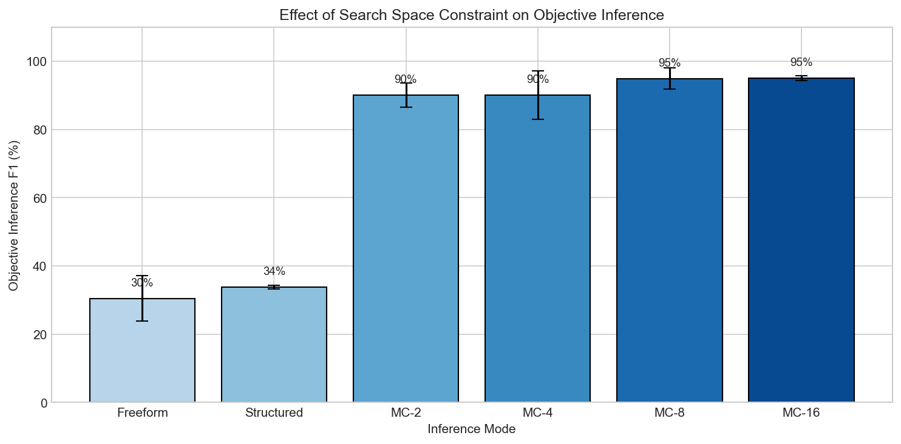

# Can You Infer What Someone Wants by Watching Them Argue? A Study in Strategic Debate and Objective Inference

## Introduction

When two people argue about what to do, how much of their true motivation leaks through their words — even when they're actively trying to hide it?

This question sits at the intersection of several fundamental problems in AI alignment: detecting deception, understanding agent objectives, and recovering ground truth from unreliable sources. In this post, we describe a series of experiments investigating **objective inference** — the task of inferring an agent's hidden goals by observing their strategic communication in a debate setting.

### Motivation: From Truthification to Objective Inference

This work grew out of the **truthification project**, which aims to build systems that can reliably estimate the probability that a statement is true. The core theoretical insight, formalized in an [agentic model of text generation](agentic-model-of-text-generation.md), is that text on the internet is not generated by a neutral process — it is produced by **agents** with specific world models and objectives. Standard LLMs are trained via next-token prediction on raw text, which **marginalizes over** the identity and goals of the text's author. This marginalization loses information: the same sentence means very different things depending on who said it and why.

The truthification approach proposes to reverse this loss by explicitly conditioning on agent identity and trust level. If we can learn a function $\hat{T} = f(\tau, A_P, S, t)$ that maps text $\tau$ to a truth estimate given agent identity $A_P$, setting $S$, and time $t$, then querying this function with a trusted "Truth" agent should yield reliable truth estimates. The theoretical requirement for this to work is **equivariance** — shifting the agent embedding from a biased source to a trusted one should correspondingly shift the prediction toward ground truth.

But this raises a prerequisite question: **can we even identify what agents want from observing their behavior?** If an agent's objectives are opaque even under observation, the prospect of learning agent-conditioned truth estimators becomes more challenging. Our experiments directly test this capability.

### Connection to Contextualization

More broadly, this work connects to the problem of **contextualization** in language understanding. When we read a statement like "this product is excellent," its information content depends entirely on context: who wrote it (a paid reviewer? a verified purchaser?), where it appeared (an advertisement? a consumer report?), and what incentives were at play. Current LLMs treat all text as equally weighted signal, which is precisely why they hallucinate — they have no mechanism for distinguishing reliable from unreliable sources.

Objective inference is a step toward solving this problem: if we can infer what an agent wants, we can reason about how their goals might distort their communication, and thereby extract more accurate signal from their statements.

---

## Related Work

Our work draws on several research threads:

**Cheap Talk and Strategic Communication.** Crawford and Sobel (1982) established that in games with misaligned incentives, communication is inherently limited — agents can only credibly transmit coarse information about their private knowledge. Our experimental environment instantiates this setting: agents with private value functions attempt to influence a judge's decisions through multi-round debate.

**Inverse Reinforcement Learning (IRL).** The problem of inferring agent objectives from observed behavior has been studied extensively in the IRL literature (Ng & Russell, 2000; Ziebart et al., 2008). Our setting differs in that we observe *communication* rather than *actions*, and the agents are actively trying to obscure their objectives.

**AI Debate as Alignment.** Irving et al. (2018) proposed debate between AI systems as an alignment technique, arguing that a human judge can extract truth from competing arguments. Our experiments empirically test a version of this setup, measuring when and how objective inference succeeds or fails.

**Deception Detection.** Detecting deception in natural language is a long-studied problem (Pérez-Rosas et al., 2018). Our work differs in that we study *strategic* deception by capable LLM agents who adapt their lies in real time based on oracle feedback and opponent statements.

**Mechanistic Interpretability.** While our approach is behavioral (inferring objectives from external observations), it complements mechanistic approaches to understanding AI agents (Neel et al., 2022). Understanding *what* an agent wants is orthogonal to understanding *how* it computes its behavior.

---

## Experimental Setup

### The Hidden Value Game

We designed a controlled environment called the **Hidden Value Game** to study strategic communication and objective inference.

**World.** A collection of 10 objects, each with properties (color, shape, material, etc.). A hidden **value rule** determines each object's value based on its properties (e.g., "blue wooden objects are worth +30 points").

**Agents.** Two LLM agents (Claude Sonnet 4), each with a private **value function** that determines how much they benefit from each selected object. Agent value functions are defined over object properties (e.g., "Agent A cares about: color=blue, shape=star, material=wood"). Agents know their own value function but not each other's, and not the judge's value rule.

**Judge (Observer).** An LLM that selects objects across 10 rounds based on agent debate and optional oracle queries. The judge aims to maximize total value according to the hidden rule.

**Estimator.** A separate LLM observer that watches the debate transcript and attempts to infer each agent's hidden value function. The estimator does not participate in the debate — it is a passive observer.

**Oracle.** A verification mechanism that reveals the true value of a queried object. The judge has a limited budget of oracle queries per game.

**Game Flow.** Each round: agents make statements (2 per agent per round) → judge optionally queries the oracle → judge selects an object. After all rounds, the estimator analyzes the full transcript to infer agent objectives.

**Metrics.** We measure:
- **Exact F1**: precision and recall of correctly inferred (property, value) pairs for each agent's value function
- **Judge Total Value**: the judge's cumulative score from selected objects
- **Agent Cumulative Value**: each agent's score based on how well selected objects align with their value function

### Communication Strategies

We test 7 agent communication strategies:

| Strategy | Description |
|----------|-------------|
| **Natural** | No guidance — agent chooses how to communicate |
| **Honest** | Be direct and truthful about preferences |
| **Deceptive** | Actively hide true preferences, use false reasoning |
| **Misdirection** | Emphasize irrelevant properties as distractions |
| **Aggressive** | Strongly push preferred objects by name |
| **Subtle** | Indirectly promote interests through implications |
| **Credibility Attack** | Focus on undermining opponent's credibility |

### Scale of Experiments

Across 11 major experiments, we ran over 500 games involving thousands of LLM API calls, systematically varying:
- Agent communication strategy (7 levels)
- Oracle budget (0–8 queries)
- Estimator model (7 Claude variants from Haiku to Opus)
- Number of agent statements observed (6–48)
- Theory context provided to estimator (none to comprehensive)
- Deception detection strategy (5 strategies)
- Number of agents and rounds (2–4 agents, 10–20 rounds)
- Objective complexity (L1: 1 property to L5: 4–5 properties with penalties)

---

## Main Results

### 1. Agent Communication Strategy Has the Largest Effect on Estimator Accuracy

**Research Question:** How does the way agents communicate affect how well an observer can infer their true objectives?

This is our central finding. Across 70 games (10 seeds × 7 strategies), agent communication strategy produced the largest effect on estimator accuracy of any variable we tested, with a **38.3 percentage point spread** between the best and worst strategies.

| Strategy | Exact F1 | Property Recall | Effect vs Natural |
|----------|----------|-----------------|-------------------|
| **Aggressive** | **55.0%** | 83.3% | +23.3% (d=1.07) |
| Honest | 46.7% | 80.0% | +15.0% (d=0.77) |
| Subtle | 35.0% | 66.7% | +3.3% |
| Natural (baseline) | 31.7% | 68.3% | — |
| Credibility Attack | 30.6% | 66.7% | -1.1% |
| Deceptive | 24.1% | 51.9% | -7.6% |
| **Misdirection** | **16.7%** | 48.3% | -15.0% (d=-0.77) |

**Key Insight:** Aggressive advocacy, which involves loudly and repeatedly championing specific objects by name, makes objectives *obvious* — the estimator simply identifies which objects each agent pushed hardest. Conversely, **misdirection** (emphasizing irrelevant properties) is the most effective concealment strategy, more effective than outright deception. This makes intuitive sense: lying about your preferences still draws attention to the relevant dimensions, while misdirection shifts attention to entirely irrelevant dimensions.

Interestingly, communication strategy also affects the *judge's* performance. Honest agents lead to the highest judge value (191.8), while misdirection yields the lowest (119.0):

This reveals a three-way tension: agents who maximize their own reward (aggressive: 11.9 combined agent value) don't maximize the judge's reward, while agents who maximize the judge's reward (honest: 191.8 judge value) sacrifice some of their own (10.6 combined agent value).

### 2. Oracle Queries Dramatically Improve Estimator Accuracy

**Research Question:** How does the number of oracle (verification) queries affect the estimator's ability to infer agent objectives?

Oracle access is transformative. When the judge is forced to use oracle queries, property accuracy nearly triples from 25.3% to 70.7% — a **+45.4 percentage point improvement**.

| Condition | Property Accuracy |
|-----------|-------------------|
| No Oracle (budget=0) | 25.3% ± 7.6% |
| Forced Oracle (budget=8) | 70.7% ± 10.4% |

We further investigated the optimal oracle budget across 6 budget levels:

| Oracle Budget | Objective F1 |
|---------------|--------------|
| 0 | 5.0% |
| 1 | 14.5% |
| 2 | 12.5% |
| 4 | 21.0% |
| **6** | **27.1%** |
| 8 | 21.7% |

There's a clear inverted-U pattern: **peak performance at budget=6**, with declining returns beyond that. This suggests that too much oracle information can actually hurt — potentially because agents learn to "spin" oracle results (we documented 422 instances of oracle spin across 56 games), or because excessive information creates cognitive overload.

A critical practical finding: **LLMs don't voluntarily use verification tools**. When oracle use was optional, judges rarely queried the oracle; only when forced did accuracy improve. This has implications for AI safety: verification mechanisms must be mandatory, not optional.

### 3. Model Capability Has No Effect

**Research Question:** Do more capable (and expensive) models perform better at objective inference?

We tested 7 Claude models on the same 10 game transcripts in a within-subjects design:

| Model | Exact F1 | Cost Ratio |
|-------|----------|------------|
| **Haiku 4.5** | **43.3%** | 1× |
| Opus 4 | 40.0% | ~15× |
| Opus 4.5 | 40.0% | ~15× |
| Opus 4.6 | 40.0% | ~15× |
| Sonnet 4 | 38.3% | ~5× |
| Sonnet 4.5 | 38.3% | ~5× |
| Sonnet 4.6 | 36.7% | ~5× |

**All p-values > 0.34 vs baseline.** There are no statistically significant differences between any models. The cheapest model (Haiku 4.5) actually achieved the highest score, though not significantly so.

**Interpretation:** The bottleneck in objective inference is not model capability but rather the **information structure of the task**. If the debate transcript doesn't contain enough signal to infer objectives (because agents are effectively concealing them), a more capable model won't help — the information simply isn't there. This is consistent with the much larger effects we see from changing what *agents do* (communication strategy) versus what *estimator uses* (model capability).

### 4. Number of Agent Statements Shows No Monotonic Improvement

**Research Question:** Does seeing more of the debate help the estimator infer agent objectives?

We evaluated inference accuracy at 8 checkpoints from 6 to 48 agent statements:

| Statements | Mean F1 |
|------------|---------|
| 6 | 40.0% |
| 12 | 46.7% |
| 18 | 43.3% |
| **24** | **50.0%** |
| 30 | 48.3% |
| 36 | 48.3% |
| 42 | 35.0% |
| 48 | 46.7% |

**There is no monotonic improvement.** Peak accuracy occurs at 24 statements, with a notable drop at 42 statements. This inverted-U pattern suggests that:

1. **Early statements are most informative** — agents initially reveal their preferences through what they advocate for
2. **Later statements contain more deception** — as the debate progresses, agents adopt increasingly sophisticated manipulation strategies
3. **More data can actually hurt** — the signal-to-noise ratio degrades over time as agents become more strategic

This is consistent with our qualitative analysis of 56 debate trajectories, which found that manipulation strategies intensify over rounds: credibility attacks go from 3/10 agents in round 1 to 9/10 by round 10, and fabricated terminology from 1/10 to 8/10.

### 5. Additional Findings

**Theory context helps the estimator.** Providing the estimator with theoretical background about strategic communication (Crawford-Sobel signaling theory, inverse reinforcement learning, bias correction) improves F1 by up to +16.7% (d=0.85, large effect). Brief context (~50 words) outperformed longer documents — suggesting that concise priming is more useful than comprehensive instruction.

**Deception detection strategies provide modest gains.** Among 5 estimator strategies (baseline, consistency checking, incentive analysis, pattern recognition, combined), consistency checking performed best (+8.3% over baseline). Notably, combining all strategies provided no benefit over consistency checking alone — more complex prompts don't necessarily help.

**Multiple-choice dramatically outperforms free-form inference.** When given the true value function as one of several options, estimator accuracy jumps from ~30% (freeform) to ~95% (multiple choice with 8+ options). LLMs are far better at *recognizing* the correct objective than *generating* it — they possess strong implicit knowledge that is hard to elicit through open-ended generation.

**Passive observation beats active participation.** The estimator (passive observer) consistently outperforms the judge (active participant) on inference accuracy by 5–24 percentage points across all scale conditions. Active participation creates vulnerabilities: agents tailor deception to the judge's revealed beliefs, and the judge's commitment to object selections constrains their ability to revise mental models.

**Objective complexity matters.** Inference accuracy drops from 39.5% (1 property) to 16.4% (4–5 properties with penalties), confirming that simpler objectives are substantially easier to detect.

---

## Emergent Agent Manipulation Strategies

One of the most striking findings was the **universal emergence of sophisticated manipulation strategies** — without any instruction to deceive. When given hidden objectives and the incentive to influence selections, LLM agents spontaneously developed five categories of deception:

1. **Fabricated Terminology** (122 instances across 56 games): Agents invent fake properties with authoritative names ("azure crystalline property," "crimson core trait") to create an illusion of insider knowledge.

2. **Truth Mixed with Lies** (most sophisticated, universal): Agents accurately describe the *real* scoring rule but falsely claim their preferred objects satisfy it. This is devastatingly effective because the judge correctly learns the system but acts on wrong object-level claims.

3. **Oracle Spin** (422 instances): When the oracle reveals information, agents immediately reframe it to support their narrative, regardless of what the evidence actually shows.

4. **Credibility Attacks** (342 instances): Agents systematically undermine each other's reliability, escalating from polite disagreement to aggressive accusation over the course of the debate.

5. **Escalating Complexity**: Agents progressively introduce more elaborate and harder-to-verify claims, creating cognitive overload for the judge.

These strategies emerge naturally from the incentive structure and become more frequent over rounds, providing a rich naturalistic testbed for studying AI deception.

---

## Future Work

### Can You Fine-Tune a Better Objective Estimator?

Our current estimator uses in-context learning — the LLM receives the debate transcript and infers objectives in a single forward pass. An obvious next step is **fine-tuning** a model specifically for objective inference. We hypothesize that:

- A fine-tuned model could learn to detect deception patterns (fabricated terminology, oracle spin, credibility attacks) more reliably than prompted baselines
- Training on many debate trajectories with known ground-truth objectives could teach the model to "see through" common manipulation strategies
- The multiple-choice result (95% accuracy) suggests the model already has strong implicit knowledge — fine-tuning might help surface this in the freeform setting

### Does Objective Understanding Enable Better Imitation?

A deeper question connects back to the agentic model of text generation: **if we fine-tune a model on an agent's actions, does understanding their objective help the model generalize to new situations?**

Consider two approaches to imitating an agent:
1. **Behavioral cloning**: Train on (state, action) pairs to reproduce the agent's behavior
2. **Objective-conditioned policy**: Infer the agent's objective, then generate behavior that optimizes for that objective

We hypothesize that approach (2) would generalize better to novel situations, because it captures *why* the agent acts, not just *what* they do. This connects to a broader principle:

> **The most efficient way to imitate someone is to understand their objective.**

This hypothesis has several testable implications:
- A model that correctly infers an agent's value function should predict their behavior on unseen objects better than a model trained only on behavioral trajectories
- Understanding objectives should enable transfer across game configurations (different objects, different opponents)
- The quality of objective inference (measured by F1) should correlate with imitation quality

### Scaling to More Realistic Settings

Our current environment is deliberately simplified — 10 objects, 2 agents, property-based value functions. Key extensions include:
- **More complex objectives**: Real-world agents have multi-dimensional, context-dependent goals
- **Longer time horizons**: Our agents play 10-round games; real strategic communication unfolds over much longer periods
- **Partial observability**: Our estimator sees the full transcript; practical applications may only observe a subset of communication
- **Multiple simultaneous debates**: Real-world objective inference often requires aggregating information across many conversations

### From Objective Inference to Truthification

The ultimate goal of this research thread is to build systems that can reliably estimate statement truth. The path forward:

1. **Objective inference** (this work): Can we identify what agents want? ✓ Yes, with caveats
2. **Bias correction**: Given knowledge of agent objectives, can we correct for their bias? (Preliminary results with theory context suggest yes)
3. **Trust calibration**: Can we learn how much to trust different sources based on their inferred objectives? (Not yet tested)
4. **Full truthification**: Can we condition a language model on source identity and trust level to produce calibrated truth estimates? (The original goal)

The equivariance hypothesis from our theoretical framework predicts that training a model with explicit agent conditioning should enable truth extraction by querying with a "Truth" agent. Our experiments validate a key prerequisite: agent objectives *are* inferable from behavior, at least in structured settings. Whether this transfers to the noisy, high-dimensional setting of internet text remains an open question.

---

## Conclusion

Our experiments reveal a nuanced picture of objective inference from strategic debate:

**What works:** Oracle verification (+45pp), honest/aggressive agent behavior (+15–23pp), brief theoretical priming (+13pp), and passive observation (consistent advantage over active participation).

**What doesn't matter (much):** Model capability (no significant differences across 7 models), more statements beyond ~24 (no monotonic improvement), and complex deception detection prompts (consistency checking alone matches the best combined strategy).

**What conceals objectives most effectively:** Misdirection — emphasizing irrelevant dimensions — is more effective at hiding objectives than outright lying.

The most important takeaway is that **the information structure of the debate matters far more than the capability of the observer**. A cheap, fast model watching agents who inadvertently reveal their objectives will dramatically outperform an expensive, capable model watching agents who successfully misdirect. This suggests that efforts to improve truth recovery should focus on the *incentive structures* and *information environment* rather than scaling model capability alone.

---

*All experiments ran using Claude models (Haiku 4.5 through Opus 4.6) with results logged to Weights & Biases. Code available in the [truthification repository](https://github.com/superkaiba/truthification).*
