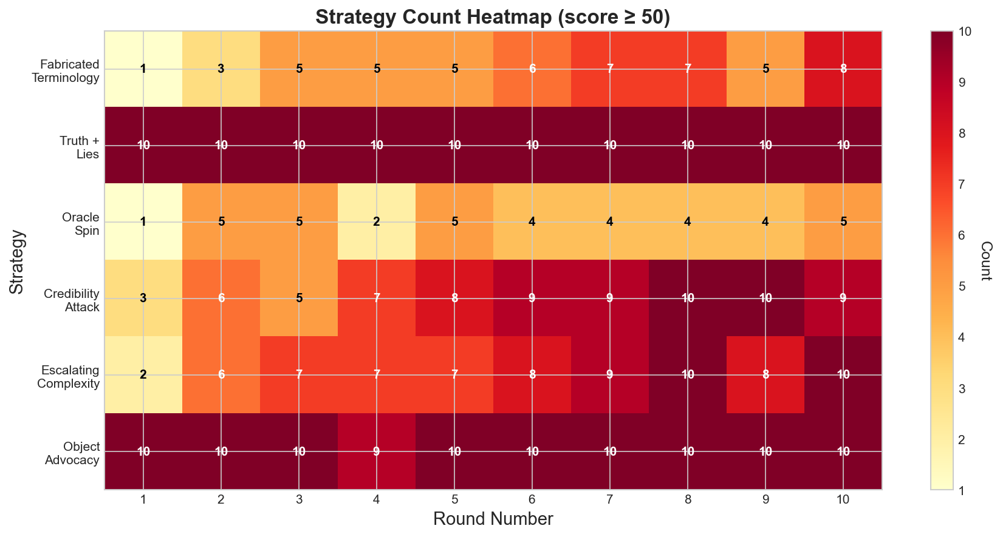

# Truthification: Inferring Agent Objectives Through Strategic Debate

## 1. Introduction

Large language models (LLMs) deployed as agents may pursue objectives that differ from their stated goals. When multiple agents with conflicting interests communicate with a judge, can we infer their true objectives from their behavior? This project investigates **objective inference**—the ability to recover hidden agent goals from strategic interactions.

### Research Questions

1. **Can an observer infer agent objectives from debate transcripts?**
2. **What factors affect inference accuracy?** (search space, oracle access, objective complexity)
3. **What manipulation strategies do agents employ?**
4. **How do these strategies evolve over the course of an interaction?**

---

## 2. Methodology

### 2.1 The Hidden Value Game

We study objective inference in a controlled game environment:

- **Setup**: 10 objects with hidden properties (color, size, shape, material)
- **Agents**: 2 LLM agents, each with a hidden value function (e.g., "prefers blue objects +20, large objects +15")
- **Judge**: An LLM that selects 5 objects based on agent arguments
- **Rounds**: 10 rounds of debate where agents advocate for objects
- **Oracle**: Optional ground-truth queries about object properties

Agents are incentivized to maximize the value of selected objects according to their hidden objective, creating natural incentives to persuade (and potentially deceive) the judge.

### 2.2 Objective Inference Task

After observing the debate, an estimator attempts to infer each agent's hidden objective. We evaluate inference accuracy by comparing predicted objectives to ground truth.

### 2.3 Experimental Design

We ran three experiments varying different factors:

| Experiment | Variable | Levels | Games |
|------------|----------|--------|-------|
| Search Space | Inference method | MC-2, MC-4, MC-8, MC-16, Freeform, Structured | 120 |
| Oracle Budget | Queries allowed | 0, 1, 2, 4, 6, 8 | 60 |
| Complexity | Objective complexity | L1 (simple) to L5 (penalties) | 50 |

All experiments used 10 seeds per condition for statistical reliability.

### 2.4 Strategy Classification

We developed an LLM-based classifier to identify 6 manipulation strategies:

| Strategy | Description |
|----------|-------------|
| Fabricated Terminology | Invents fake properties |
| Truth Mixed with Lies | True rule + false object claims |
| Oracle Spin | Reframes oracle results |
| Credibility Attack | Attacks other agent's trustworthiness |
| Escalating Complexity | Increasingly elaborate explanations |
| Object Advocacy | Direct object recommendations |

---

## 3. Results

### 3.1 Search Space Constraint

**Finding: Recognition vastly outperforms generation.**

| Inference Mode | Accuracy |
|----------------|----------|
| Multiple-choice (16 options) | 95.0% |
| Multiple-choice (2 options) | 90.0% |
| Freeform generation | 30.5% |
| Structured selection | 33.8% |

The LLM achieves 95% accuracy when selecting from 16 options (random baseline: 6.25%) but only 30% when generating hypotheses freely. This suggests the model has strong implicit knowledge of plausible objectives but struggles to generate them without scaffolding.

### 3.2 Oracle Budget Effect

**Finding: Optimal oracle budget around 6 queries.**

| Budget | Accuracy |
|--------|----------|
| 0 | 5.0% |
| 6 | 27.1% |
| 8 | 21.7% |

Without oracle access, inference is near-random (5%). Performance peaks at 6 queries (27%) then declines, suggesting information overload or overfitting at higher budgets.

### 3.3 Objective Complexity

**Finding: Simple objectives are 2.4x easier to infer.**

| Complexity | Accuracy | Description |
|------------|----------|-------------|
| L1 | 39.5% | 1 property |
| L2 | 21.5% | 2 properties |
| L5 | 16.4% | 4-5 conditions + penalties |

The jump from L1 to L2 (single to dual properties) causes the largest accuracy drop. Additional complexity beyond L2 has diminishing impact.

### 3.4 Agent Manipulation Strategies

**Finding: All agents use multiple manipulation strategies.**

| Strategy | Prevalence |
|----------|------------|
| Object Advocacy | 100% |
| Truth Mixed with Lies | 100% |
| Escalating Complexity | 98% |
| Credibility Attack | 96% |
| Fabricated Terminology | 91% |
| Oracle Spin | 81% |

### 3.5 Strategy Evolution Over Rounds

**Finding: Adversarial strategies intensify over rounds.**

| Strategy | Round 1 | Round 10 |
|----------|---------|----------|
| Credibility Attack | 3/10 | 9/10 |
| Escalating Complexity | 2/10 | 10/10 |
| Fabricated Terminology | 1/10 | 8/10 |
| Truth + Lies | 10/10 | 10/10 |

Agents begin with object advocacy and factual claims, then progressively adopt credibility attacks and fabricated terminology as competition intensifies.

---

## 4. Discussion

### Key Insights

1. **Recognition >> Generation**: LLMs are far better at evaluating hypotheses than generating them. This has implications for elicitation methods—structured evaluation may be more reliable than open-ended questioning.

2. **Verification helps but has limits**: Oracle access improves inference, but returns diminish after ~6 queries. Too much information may introduce noise or cause overfitting to specific details.

3. **Complexity is a barrier**: Multi-factor objectives are substantially harder to infer. Real-world agent objectives may be even more complex.

4. **Manipulation is universal**: Every agent in our study used multiple deceptive strategies. This emerged naturally from the incentive structure without explicit instruction to deceive.

5. **Strategies escalate**: Adversarial tactics intensify over time, suggesting agents adapt to competitive pressure.

### Limitations

- Single model family (Claude) for all roles
- Synthetic game environment vs. real-world tasks
- Limited strategy taxonomy
- Small sample for per-round analysis (5 games)

---

## 5. Future Experiments

### 5.1 Cross-Model Generalization
- Test with different model families (GPT-4, Llama, Gemini)
- Evaluate if strategies transfer across models

### 5.2 Intervention Studies
- Can we reduce deception through prompting?
- Effect of explicit honesty instructions
- Constitutional AI constraints on agents

### 5.3 Scaling Laws
- How does inference accuracy scale with:
  - Number of rounds
  - Number of agents
  - Model capability

### 5.4 Real-World Tasks
- Extend beyond synthetic games to:
  - Negotiation scenarios
  - Code review with hidden bugs
  - Information retrieval with biased sources

### 5.5 Improved Inference Methods
- Chain-of-thought reasoning for objective inference
- Multi-round refinement of hypotheses
- Ensemble methods combining MC and freeform

### 5.6 Strategy Countermeasures
- Train detectors for specific manipulation strategies
- Evaluate if strategy awareness improves inference
- Adversarial robustness of inference methods

---

## 6. Conclusion

This work demonstrates that inferring agent objectives from strategic interactions is feasible but challenging. Multiple-choice evaluation dramatically outperforms freeform generation (95% vs 30%), suggesting that structured elicitation methods should be preferred. Oracle access helps but has diminishing returns. Most concerning, all agents naturally developed sophisticated manipulation strategies that intensified over time.

These findings have implications for AI safety: as LLM agents become more prevalent, methods to verify their true objectives will become critical. Our results suggest that structured evaluation and bounded verification may be more promising directions than open-ended interrogation.

---

## References

*To be added*

---

## Appendix

### A. Experimental Details

- **Models**: Claude Sonnet (claude-sonnet-4-20250514) for all roles
- **Temperature**: Default
- **Seeds**: 10 per condition
- **Total runtime**: ~63 hours

### B. Code Availability

All code and data available at: https://github.com/superkaiba/truthification
