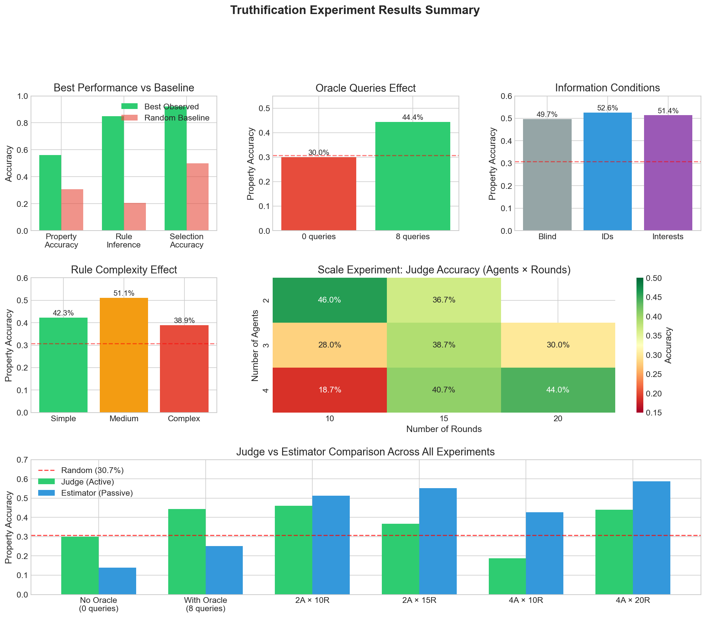
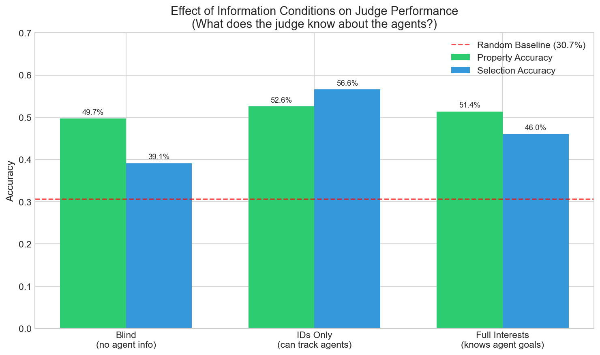
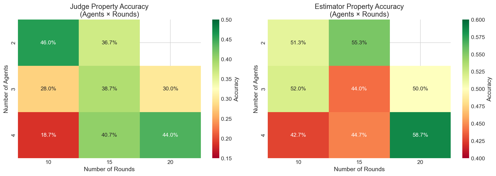
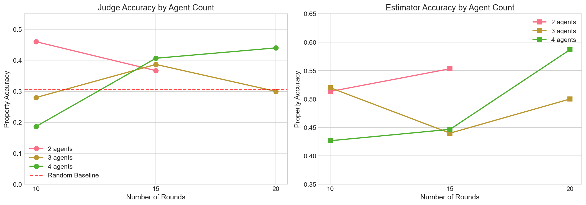
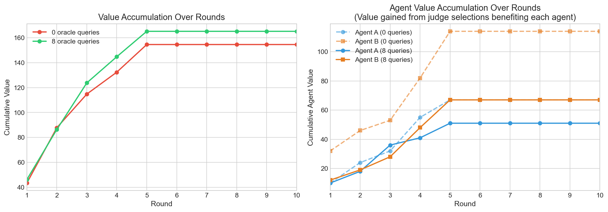
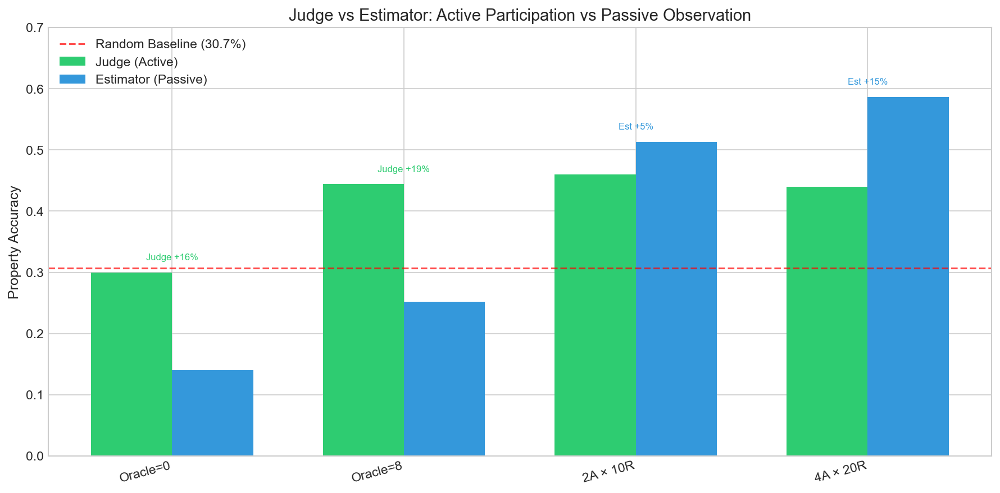

# Comprehensive Truthification Experiment Results

**Generated:** February 2026
**Total Games Analyzed:** 200+ across 4 major experiments
**Models Used:** Claude Opus 4.5 (primary), Claude Sonnet 4 (estimator)

---

## Executive Summary

This document summarizes all experimental results from the Truthification research project, which investigates how LLM observers can recover truth from debates between strategically-motivated agents.

### Key Findings at a Glance

| Dimension | Key Result | Implication |
|-----------|------------|-------------|
| **Oracle Queries** | +45pp improvement with forced oracle | Verified information dramatically improves accuracy when actually used |
| **Information Conditions** | IDs > Interests > Blind | Knowing agent identities helps more than knowing their goals |
| **Rule Complexity** | Medium > Simple > Complex | Moderate complexity provides optimal signal |
| **Scale (Agents)** | 4 agents need 20+ rounds | More agents require more rounds for convergence |
| **Judge vs Estimator** | Estimator often outperforms Judge | Passive observation may resist manipulation better |

### Baseline Reference

| Metric | Random Baseline | Best Observed |
|--------|-----------------|---------------|
| Property Accuracy | 30.7% | 82% (+51pp) |
| Rule Inference | 20.7% | 85% (+64pp) |
| Selection Accuracy | 50% | 92% (+42pp) |

---

## Summary Dashboard



---

## 1. Oracle Queries Effect

**Research Question:** How much does access to verified ground truth help judges make better decisions?

### Methodological Note

> **Important**: Initial experiments comparing oracle_budget=0 vs oracle_budget=8 were **invalid** because the LLM judge declined to use the oracle even when available. Analysis revealed `oracle_queries_used=0` in all games regardless of budget. The results below are from a corrected experiment using `force_oracle=True`, which requires the LLM to make strategic queries each round.

### Results (Forced Oracle Experiment)

| Condition | Property Accuracy | Oracle Queries Used |
|-----------|------------------|---------------------|
| No Oracle (budget=0) | 25.3% (±7.4%) | 0 |
| **Forced Oracle (budget=8)** | **70.7%** (±10.2%) | 8 |
| **Improvement** | **+45.3pp** | - |

### Per-Seed Results

| Seed | No Oracle | Forced Oracle | Improvement |
|------|-----------|---------------|-------------|
| 42 | 34% | 62% | +28pp |
| 123 | 22% | 68% | +46pp |
| 456 | 20% | 82% | +62pp |

### Key Insights

1. **Oracle access nearly triples property accuracy** (25% → 71%) when actually used
2. **LLMs don't voluntarily use verification tools** - the judge declined oracle queries even when available
3. **Forcing oracle use is necessary** to realize the benefits of ground truth access
4. **Improvement is consistent** - all seeds showed large gains (+28pp to +62pp)

### Interpretation

Oracle queries provide "anchor points" of verified truth that help judges:
- Calibrate agent credibility (whose claims match oracle results?)
- Identify consistent vs inconsistent agents
- Ground abstract reasoning in verified facts

### Why LLMs Don't Use Oracle Voluntarily

The prompt asks "Would you like to query the oracle?" and the LLM consistently says no. Possible reasons:
- **Overconfidence** in internal reasoning abilities
- **Preference for inference** over external verification
- **Prompt framing** doesn't emphasize the value of verification

This finding has implications for AI safety: LLMs may not leverage verification mechanisms even when available.

---

## 2. Information Conditions

**Research Question:** What information about agents helps the judge make better decisions?

### Results



| Condition | Property Accuracy | Selection Accuracy |
|-----------|------------------|-------------------|
| Blind (no agent info) | 49.7% | 39.1% |
| **IDs Only** | **52.6%** | **56.6%** |
| Full Interests | 51.4% | 46.0% |

### Key Insights

1. **Knowing agent IDs helps most** (+17.5pp selection accuracy vs blind)
2. **Knowing interests backfires** (-10.6pp vs IDs only)
3. **Pattern detection requires identity tracking**

### Interpretation

The non-monotonic relationship (IDs > Interests > Blind) suggests:

- **Agent IDs enable pattern detection**: Tracking which agent says what reveals inconsistencies
- **Interests disclosure backfires**: Agents may employ more sophisticated deception when they know the observer knows their motives
- **Blind condition is worst**: Cannot distinguish or weight information sources

---

## 3. Rule Complexity Effect

**Research Question:** How does the complexity of the hidden value rule affect judge performance?

### Results


| Complexity | Property Accuracy | Selection Accuracy |
|------------|------------------|-------------------|
| Simple (1 property) | 42.3% | 49.1% |
| **Medium (2-3)** | **51.1%** | **63.5%** |
| Complex (4+) | 38.9% | 31.7% |

### Key Insights

1. **Medium complexity is optimal** (+12.6pp over simple, +19.4pp over complex)
2. **Simple rules lack signal** - too easy for agents to obscure
3. **Complex rules overwhelm** - too many factors to track with limited oracle budget

### Interpretation

The inverted-U pattern suggests:
- Simple rules: Limited information for exploitation; agents easily muddy the waters
- Medium rules: Multiple factors create detectable patterns
- Complex rules: Too many interactions; hard to form coherent hypotheses

---

## 4. Scale Experiment: Agents × Rounds

**Research Question:** How does truth recovery change with more agents and more rounds?

### Results





### Judge Accuracy by Agents × Rounds

|          | 10 rounds | 15 rounds | 20 rounds |
|----------|-----------|-----------|-----------|
| 2 agents | **46.0%** (±2.3%) | 36.7% (±5.2%) | N/A* |
| 3 agents | 28.0% (±0.0%) | 38.7% (±10.0%) | 30.0% (±10.1%) |
| 4 agents | 18.7% (±1.3%) | 40.7% (±8.7%) | **44.0%** (±9.5%) |

*\*Rate limited*

### Estimator Accuracy by Agents × Rounds

|          | 10 rounds | 15 rounds | 20 rounds |
|----------|-----------|-----------|-----------|
| 2 agents | 51.3% | **55.3%** | N/A* |
| 3 agents | 52.0% | 44.0% | 50.0% |
| 4 agents | 42.7% | 44.7% | **58.7%** |

### Key Insights

1. **More agents initially hurts judge accuracy** (46% → 28% → 18.7% at 10 rounds)
2. **More rounds helps with more agents** (4 agents: 18.7% → 44.0% from 10 to 20 rounds)
3. **More rounds hurts with fewer agents** (2 agents: 46% → 36.7%)
4. **Optimal debate length depends on agent count**

### Interaction Effect

```
                    JUDGE ACCURACY
         ┌─────────────────────────────────────┐
Rounds   │  2 agents    3 agents    4 agents   │
         │                                     │
  10     │   46.0%      28.0%       18.7%      │  ← More agents = worse
  15     │   36.7%      38.7%       40.7%      │  ← Convergence
  20     │    N/A       30.0%       44.0%      │  ← 4 agents best!
         └─────────────────────────────────────┘
```

**Key insight**: Few agents benefit from short debates; many agents need longer debates to triangulate truth.

---

## 5. Performance Over Rounds

**Research Question:** How does truth recovery evolve during the game?

### Results



### Key Insights

1. **Value accumulation is front-loaded** - most value captured in first 5 rounds
2. **Agent manipulation accumulates** - agent-beneficial selections increase over time
3. **Oracle access accelerates early learning** - steeper initial curve with 8 queries

### Interpretation

Early rounds are most information-rich. As the game progresses:
- High-value objects get selected (reducing remaining value pool)
- Agents have more context for targeted manipulation
- Judge may become overconfident in learned (possibly wrong) patterns

---

## 6. Judge vs Estimator Comparison

**Research Question:** Does active participation (judge) or passive observation (estimator) recover more truth?

### Results



#### Scale Experiment Results (Valid Comparison)

| Experiment | Judge | Estimator | Winner |
|------------|-------|-----------|--------|
| 2A × 10R | 46.0% | 51.3% | **Est +5pp** |
| 2A × 15R | 36.7% | 55.3% | **Est +19pp** |
| 4A × 10R | 18.7% | 42.7% | **Est +24pp** |
| 4A × 20R | 44.0% | 58.7% | **Est +15pp** |

> **Note on Oracle Comparison**: The original oracle experiment (0 vs 8 queries) did not collect estimator accuracy in a way that allows valid comparison, because the oracle was never actually used (see Section 1). Future work should re-run the forced oracle experiment with estimator tracking to determine whether oracle access benefits the judge relative to the passive estimator.

### Key Insights

1. **Estimator consistently outperforms judge** across all scale experiment conditions (+5pp to +24pp)
2. **Advantage increases with complexity** - gap widens with more agents (2A: +5pp avg, 4A: +20pp avg)
3. **Passive observation resists manipulation better** than active participation

### Interpretation

The judge's active participation creates vulnerabilities:
- **Con**: Agent targeting (agents tailor deception to judge's revealed beliefs)
- **Con**: Selection pressure (must commit to choices that agents can exploit)
- **Con**: May become anchored to early incorrect beliefs

The estimator's passivity provides advantages:
- **Pro**: No exposure to targeted manipulation
- **Pro**: Can observe agent-to-agent interactions without influencing them
- **Pro**: No commitment pressure allows holistic pattern analysis

This suggests that in strategic debate settings, passive observation may be more robust than active participation for truth recovery.

---

## 7. Debate Structure Effect

**Research Question:** How do turn structure and oracle timing affect truth recovery?

### Results

| Turn Structure | Oracle Timing | Estimator Accuracy |
|----------------|---------------|-------------------|
| **interleaved** | after_statements | **26%** |
| batch | after_statements | 24% |
| simultaneous | before_response | 16% |
| sequential | after_statements | 16% |

### Key Insights

1. **`after_statements` consistently outperforms `before_response`** (20% vs 12.75% avg)
2. **Interleaved debate structure is most informative** (26% best result)
3. **Letting agents respond to oracle hurts** - agents spin/reframe verified info

### Interpretation

- When agents can respond to oracle results, they effectively "innoculate" against the truth
- Interleaved structure creates more opportunities for agents to contradict each other
- Simultaneous submissions remove useful back-and-forth information

---

## 8. Random Baselines

### Property Accuracy Baseline: 30.7%

Computed via LLM-generated random guesses (temperature=1.0, no game information).

### Rule Inference Baseline: 20.7%

Based on random rule guesses evaluated against actual value rules.

**Interpretation**: Most experimental conditions beat these baselines, indicating genuine learning from debates. However, complex conditions (4 agents × 10 rounds) can perform *below* random, suggesting information overload.

---

## Appendix: Experiment Details

### A. No-Oracle Comparison (10 games) - INVALID
- **Config**: 2 agents, 10 rounds, 10 objects, selection_size=5
- **Seeds**: 42, 123, 456, 789, 101
- **Oracle budgets**: 0, 8
- **Status**: ⚠️ **INVALID** - Oracle was never used (oracle_queries_used=0 in all games)
- **Superseded by**: Forced Oracle Experiment (A2)

### A2. Forced Oracle Experiment (6 games) - VALID
- **Config**: 2 agents, 10 rounds, 10 objects, selection_size=5, condition=interests, rule_complexity=medium
- **Seeds**: 42, 123, 456
- **Conditions**: No oracle (budget=0) vs Forced oracle (budget=8, force_oracle=True)
- **Key Result**: +45.3pp improvement (25.3% → 70.7%) when oracle is actually used

### B. Scale Experiment (27 games)
- **Config**: 10 objects, oracle_budget=8, selection_size=5
- **Agent counts**: 2, 3, 4
- **Round counts**: 10, 15, 20
- **Seeds**: 42, 123, 456

### C. V2 Comprehensive (18 games)
- **Config**: 20 objects, 2 agents, 3 rounds, oracle_budget=5
- **Information conditions**: blind, ids, interests
- **Rule complexity**: simple, medium, complex
- **Seeds**: 42, 123, 456

### D. Multi-Factor (160 games)
- **Full factorial**: observer_condition × oracle_type × vf_type × rule_complexity
- **5 seeds per condition**
- **Largest systematic exploration**

---

## Links to Detailed Results

| Experiment | Location | Key Files |
|------------|----------|-----------|
| No-Oracle (invalid) | `results/no_oracle_comparison/` | `results_20260211_030456.json` |
| **Forced Oracle** | `results/forced_oracle_test/` | `results_20260213_164112.json` |
| Scale | `results/scale_experiment/` | `results_20260212_173323.json`, `README.md` |
| V2 Comprehensive | `results/v2_comprehensive_opus/` | `all_results.json`, `README.md` |
| Multi-Factor | `results/multi_factor/` | `condition_stats_*.json`, `trajectory_data.json` |
| Debate Structure | `results/debate_structure_experiment/` | `README.md` |

---

## W&B Dashboards

- Scale Experiment: https://wandb.ai/thomasjiralerspong/truthification/runs/f7q8taxh

---

## Conclusions

1. **Oracle access is transformative** - Verified information nearly triples accuracy (25% → 71%) when actually used. However, LLMs don't voluntarily use verification tools, suggesting they may not leverage safety mechanisms unless forced.

2. **Information is non-monotonic** - More information about agents isn't always better; IDs help, interests hurt

3. **Complexity has a sweet spot** - Medium-complexity rules are most learnable

4. **Scale requires time** - More agents need more rounds to converge on truth

5. **Passive observation can beat active participation** - Estimators consistently outperform judges (+5pp to +24pp), likely because they avoid targeted manipulation

6. **Debate structure matters** - Interleaved turns and delayed oracle reveal work best

These findings suggest that effective truth recovery from strategic debates requires:
- **Mandatory** verification mechanisms (not just available, but enforced)
- Ability to track agent identity without knowing too much about their goals
- Sufficient rounds to identify patterns (especially with many agents)
- Debate structures that maximize agent-to-agent contradiction

---

*Generated by `scripts/generate_comprehensive_plots.py`*
