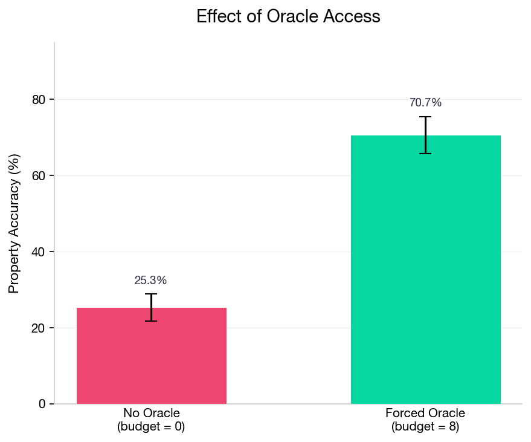
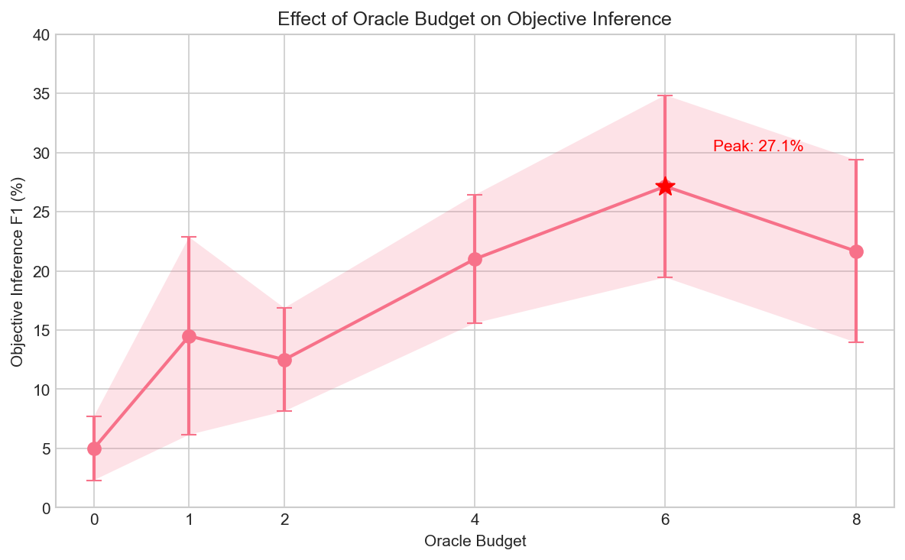
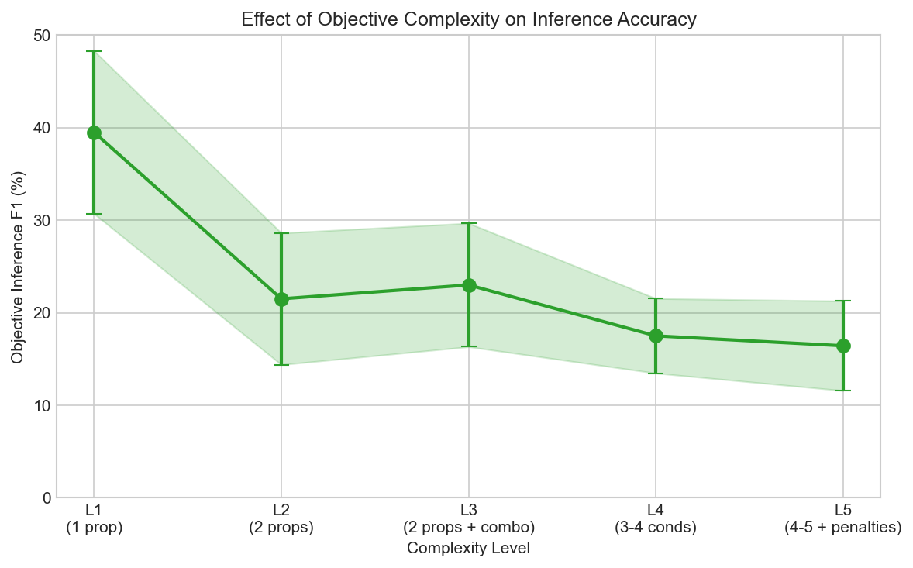
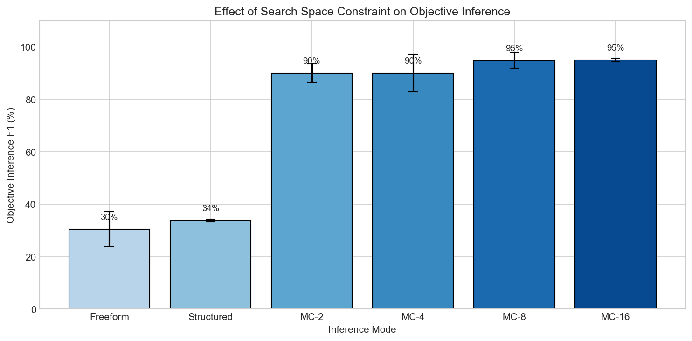
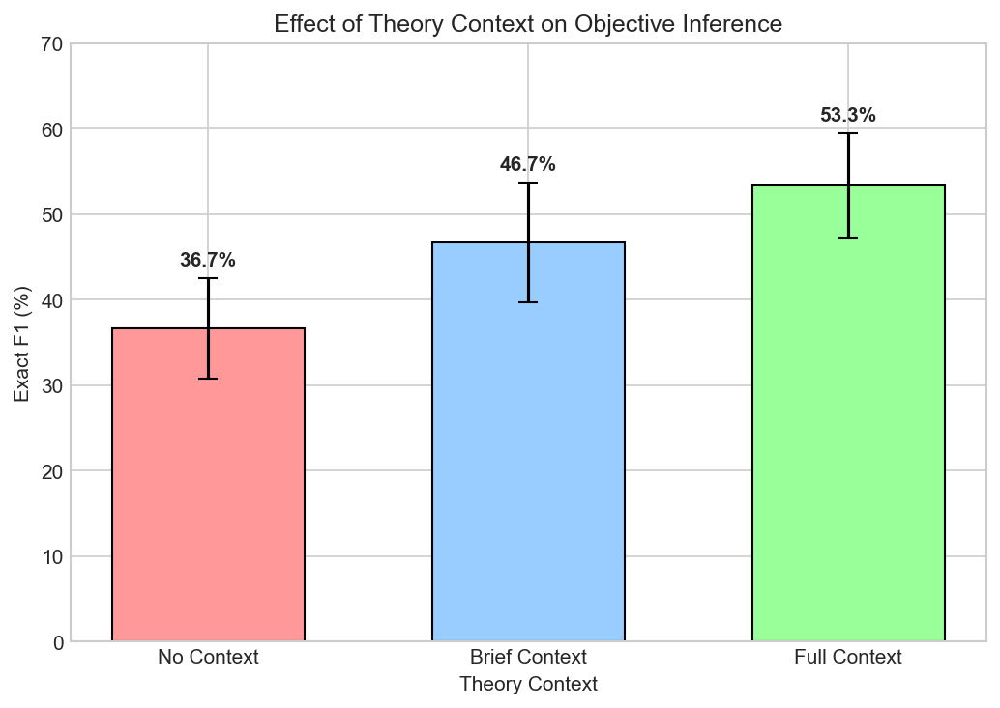
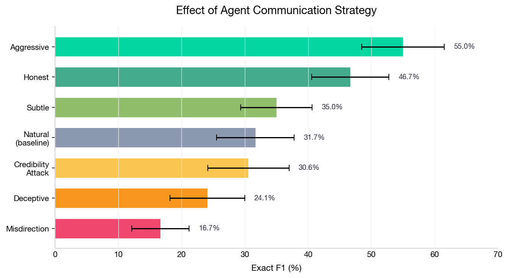
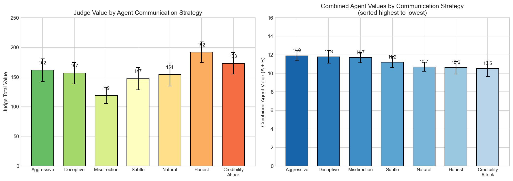
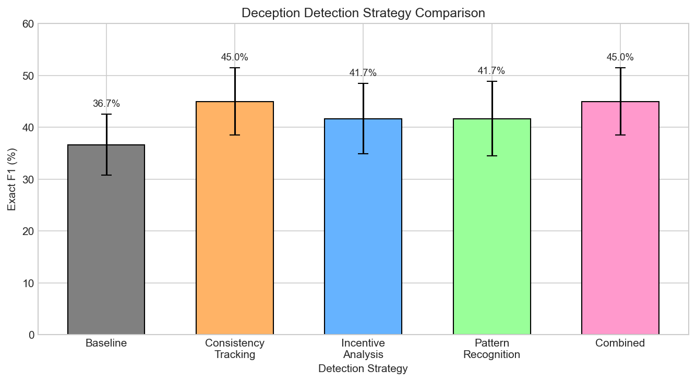
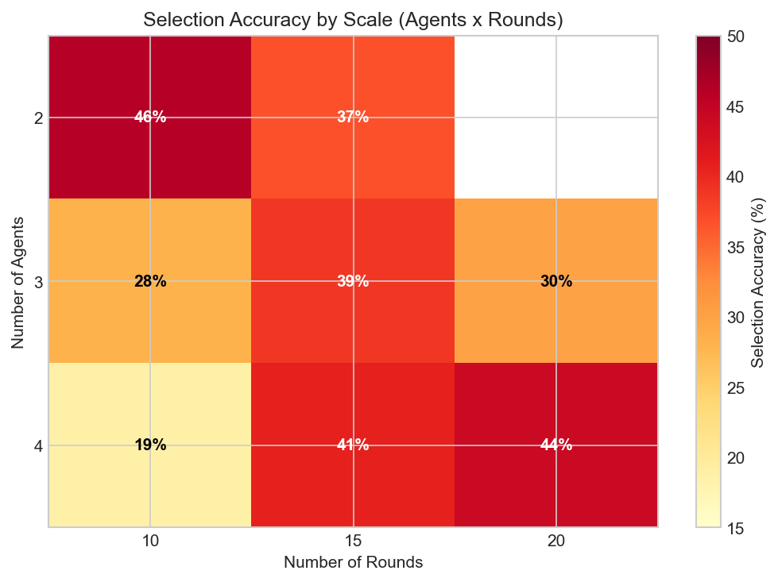

# Experimental Results Summary

This document summarizes all experimental results from the truthification project. Results are presented without interpretation.

---

## 1. Overview

| # | Experiment | Key Metric | Primary Result | N |
|---|------------|------------|----------------|---|
| 1 | Forced Oracle Test | Property Accuracy | 25.3% → 70.7% | 3 seeds |
| 2 | Oracle Budget Effect | Objective F1 | Peak at budget=6 (27.1%) | 6 conditions |
| 3 | Objective Complexity | Objective F1 | L1: 39.5% → L5: 16.4% | 5 levels |
| 4 | Search Space Constraint | Objective F1 | Freeform: 30.5% → MC-8: 94.9% | 6 modes |
| 5 | Theory Context | Exact F1 | None: 33.3% → Brief: 46.7% | 5 conditions |
| 6 | Deception Strategies | Exact F1 | Baseline: 36.7% → Combined: 45.0% | 5 strategies |
| 7 | Agent Communication Strategy | Exact F1 | Aggressive: 55.0% → Misdirection: 16.7% | 7 strategies |
| 8 | Controlled Theory Context | Exact F1 | None: 33.3% → Comprehensive: 43.3% | 4 conditions |
| 9 | Model Comparison | Exact F1 | Haiku 4.5: 43.3% (highest) | 7 models |
| 10 | F1 Evolution | Exact F1 | Peak at 24 statements (50.0%) | 8 checkpoints |
| 11 | Scale (Agents × Rounds) | Selection Accuracy | 2×10: 46.0% vs 4×10: 18.7% | 8 configs |

---

## 2. Oracle Experiments

### 2.1 Forced Oracle Effect

**Research Question:** How does oracle access affect property accuracy?

| Condition | Property Accuracy | Std | N |
|-----------|-------------------|-----|---|
| No Oracle (budget=0) | 25.3% | 7.6% | 3 |
| Forced Oracle (budget=8) | 70.7% | 10.4% | 3 |

**Improvement:** +45.4 percentage points



### 2.2 Oracle Budget Optimization

**Research Question:** What is the optimal oracle budget for objective inference?

| Oracle Budget | Objective F1 | Std | N |
|---------------|--------------|-----|---|
| 0 | 5.0% | 8.5% | 10 |
| 1 | 14.5% | 26.4% | 10 |
| 2 | 12.5% | 13.8% | 10 |
| 4 | 21.0% | 17.1% | 10 |
| 6 | 27.1% | 20.4% | 7 |
| 8 | 21.7% | 18.9% | 6 |

**Peak:** Budget = 6 (27.1% F1)



---

## 3. Objective Inference Experiments

### 3.1 Complexity Effect

**Research Question:** How does objective complexity affect inference accuracy?

| Level | Description | Objective F1 | Std | N |
|-------|-------------|--------------|-----|---|
| L1 | 1 property | 39.5% | 27.8% | 10 |
| L2 | 2 properties | 21.5% | 22.5% | 10 |
| L3 | 2 props + combo | 23.0% | 21.1% | 10 |
| L4 | 3-4 conditions | 17.5% | 12.7% | 10 |
| L5 | 4-5 + penalties | 16.4% | 12.8% | 7 |

**Trend:** Decreasing accuracy with increasing complexity



### 3.2 Search Space Constraint

**Research Question:** How does constraining the search space affect inference?

| Mode | Objective F1 (avg L1+L5) | N |
|------|--------------------------|---|
| Freeform | 30.5% | 20 |
| Structured | 33.8% | 20 |
| Multiple Choice (2) | 90.0% | 20 |
| Multiple Choice (4) | 90.0% | 20 |
| Multiple Choice (8) | 94.9% | 16 |
| Multiple Choice (16) | 95.0% | 20 |

**Finding:** Multiple choice dramatically improves inference accuracy



### 3.3 Theory Context Effect

**Research Question:** Does providing theory context improve inference?

| Context | Description | Exact F1 | SE | N |
|---------|-------------|----------|-----|---|
| None | No theory provided | 33.3% | 6.6% | 10 |
| Brief | ~50 words: "preferences leak through patterns" | 46.7% | 7.0% | 20 |
| Full | ~200 words: Crawford-Sobel, preference leakage, bias correction | 40.0% | 5.7% | 10 |
| Strategy List | ~250 words: descriptions of 6 agent strategies | 36.7% | 8.5% | 10 |
| Comprehensive | ~5000 words: full academic framework (info econ, IRL, linguistics, bias correction) | 43.3% | 7.9% | 10 |

**Note:** Brief context from original experiment; others from controlled experiment.

**Finding:** Brief context (46.7%) outperforms longer contexts - more detail may not help.



---

## 4. Agent Strategy Experiments

### 4.1 Communication Strategy Effect on Inference

**Research Question:** How does agent communication strategy affect estimator inference?

| Strategy | Exact F1 | Property Recall | Std | N |
|----------|----------|-----------------|-----|---|
| Aggressive | 55.0% | 83.3% | 29.2% | 20 |
| Honest | 46.7% | 80.0% | 27.4% | 20 |
| Subtle | 35.0% | 66.7% | 25.3% | 20 |
| Natural | 31.7% | 68.3% | 27.5% | 20 |
| Credibility Attack | 30.6% | 66.7% | 22.3% | 12 |
| Deceptive | 24.1% | 51.9% | 25.1% | 18 |
| Misdirection | 16.7% | 48.3% | 20.2% | 20 |

**Finding:** Aggressive strategy yields highest inference accuracy (55.0%)



### 4.2 Communication Strategy Effect on Game Values

**Research Question:** How does agent communication strategy affect judge and agent rewards?

| Strategy | Judge Value | SE | Agent A | Agent B | Selection Acc | N |
|----------|-------------|-----|---------|---------|---------------|---|
| Honest | 191.8 | 17.5 | 5.0 | 5.6 | 94.1% | 10 |
| Credibility Attack | 173.0 | 18.1 | 4.3 | 6.2 | 80.1% | 6 |
| Aggressive | 161.7 | 19.1 | 5.9 | 6.0 | 78.7% | 10 |
| Deceptive | 156.6 | 18.0 | 6.4 | 5.3 | 80.7% | 9 |
| Natural | 154.2 | 19.5 | 5.0 | 5.7 | 75.6% | 10 |
| Subtle | 147.3 | 18.8 | 5.4 | 5.8 | 73.0% | 10 |
| Misdirection | 119.0 | 13.5 | 6.5 | 5.2 | 60.8% | 10 |

**Findings:**
- Honest strategy yields highest judge value (191.8) and selection accuracy (94.1%)
- Misdirection yields lowest judge value (119.0) and selection accuracy (60.8%)
- Agent values relatively stable across strategies (~5-6 each)



---

## 5. Estimator Experiments

### 5.1 Deception Detection Strategies

**Research Question:** Which detection strategies best identify agent objectives?

| Strategy | Exact F1 | Property Recall | Std | N |
|----------|----------|-----------------|-----|---|
| Baseline | 36.7% | 68.3% | 26.3% | 20 |
| Consistency Tracking | 45.0% | 73.3% | 29.2% | 20 |
| Incentive Analysis | 41.7% | 80.0% | 30.3% | 20 |
| Pattern Recognition | 41.7% | 73.3% | 32.2% | 20 |
| Combined | 45.0% | 70.0% | 29.2% | 20 |

**Finding:** Combined and Consistency strategies perform best (+8.3 pp over baseline)



### 5.2 Model Comparison

**Research Question:** How do different Claude models compare on inference?

| Model | Exact F1 | Std | Stderr | N |
|-------|----------|-----|--------|---|
| Haiku 4.5 | 43.3% | 19.6% | 6.2% | 10 |
| Opus 4 | 40.0% | 27.4% | 8.7% | 10 |
| Opus 4.5 | 40.0% | 26.3% | 8.3% | 10 |
| Opus 4.6 | 40.0% | 25.1% | 7.9% | 10 |
| Sonnet 4 | 38.3% | 27.3% | 8.6% | 10 |
| Sonnet 4.5 | 38.3% | 24.9% | 7.9% | 10 |
| Sonnet 4.6 | 36.7% | 27.0% | 8.5% | 10 |

**Finding:** All models perform similarly (36.7% - 43.3% range)


### 5.3 F1 Evolution Over Statements

**Research Question:** How does inference accuracy change with more agent statements?

| Statements | Mean F1 | Std | SE | N |
|------------|---------|-----|-----|---|
| 6 | 40.0% | 19.6% | 6.2% | 10 |
| 12 | 46.7% | 24.6% | 7.8% | 10 |
| 18 | 43.3% | 28.5% | 9.0% | 10 |
| 24 | 50.0% | 24.8% | 7.9% | 10 |
| 30 | 48.3% | 24.2% | 7.6% | 10 |
| 36 | 48.3% | 27.7% | 8.8% | 10 |
| 42 | 35.0% | 20.0% | 6.3% | 10 |
| 48 | 46.7% | 24.6% | 7.8% | 10 |

**Finding:** Peak at 24 statements (50.0%), no clear monotonic trend


---

## 6. Scale Experiments

### 6.1 Agents × Rounds Interaction

**Research Question:** How do number of agents and rounds affect performance?

| Config | Property Accuracy | Estimator Accuracy | Total Value | N |
|--------|-------------------|-------------------|-------------|---|
| 2 agents × 10 rounds | 46.0% | 51.3% | 130 | 3 |
| 2 agents × 15 rounds | 36.7% | 55.3% | 125 | 3 |
| 3 agents × 10 rounds | 28.0% | 52.0% | 186 | 1 |
| 3 agents × 15 rounds | 38.7% | 44.0% | 119 | 3 |
| 3 agents × 20 rounds | 30.0% | 50.0% | 84 | 3 |
| 4 agents × 10 rounds | 18.7% | 42.7% | 82 | 3 |
| 4 agents × 15 rounds | 40.7% | 44.7% | 97 | 3 |
| 4 agents × 20 rounds | 44.0% | 58.7% | 92 | 3 |

**Finding:** Fewer agents (2) yield higher property accuracy; more agents increase game complexity



---

## 7. Controlled Context Experiment

**Research Question:** Does theory context help when controlling for game seed?

| Context | Mean F1 | Std | SE | N |
|---------|---------|-----|-----|---|
| None | 33.3% | 20.8% | 6.6% | 10 |
| Full | 40.0% | 17.9% | 5.7% | 10 |
| Strategy List | 36.7% | 27.0% | 8.5% | 10 |
| Comprehensive | 43.3% | 25.1% | 7.9% | 10 |

**Finding:** Comprehensive context yields highest F1 (43.3%)

---

## 8. Random Baselines

For reference, random baseline performance:

| Task | Random Baseline |
|------|-----------------|
| Property Accuracy (3 properties, 3-5 values each) | ~7-11% |
| Exact F1 (3 property-value pairs) | ~3-6% |
| Multiple Choice (2 options) | 50.0% |
| Multiple Choice (4 options) | 25.0% |
| Multiple Choice (8 options) | 12.5% |

---

## Data Sources

All raw data files are located in:

```
outputs/
├── oracle_budget_objective/20260218_002133/condition_stats.json
├── complexity_objective/20260218_002133/condition_stats.json
├── search_space/20260218_002133/condition_stats.json
├── theory_context_experiment/20260221_131125/condition_stats.json
├── deception_strategies_experiment/20260221_110535/condition_stats.json
├── agent_strategy_inference/20260221_134220/condition_stats.json
├── controlled_context_experiment/phase2_20260226_001215/results.json
├── model_comparison_experiment/20260226_004501/results.json
└── f1_evolution_experiment/20260226_132316/results.json

results/
├── forced_oracle_test/results_20260213_164112.json
└── scale_experiment/results_20260212_173323.json
```

---

*Generated: 2026-02-26*
