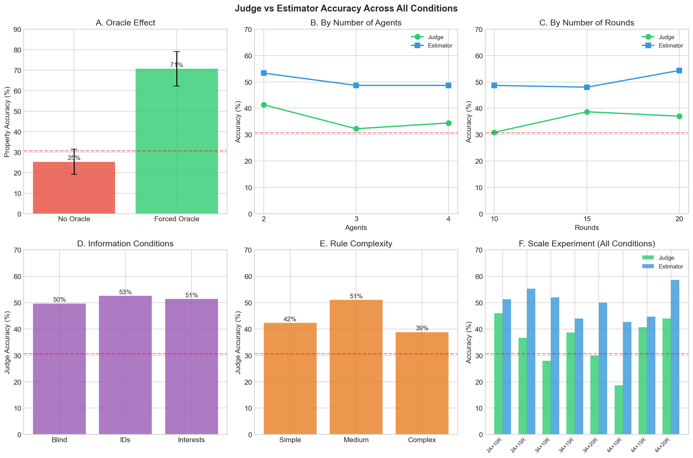
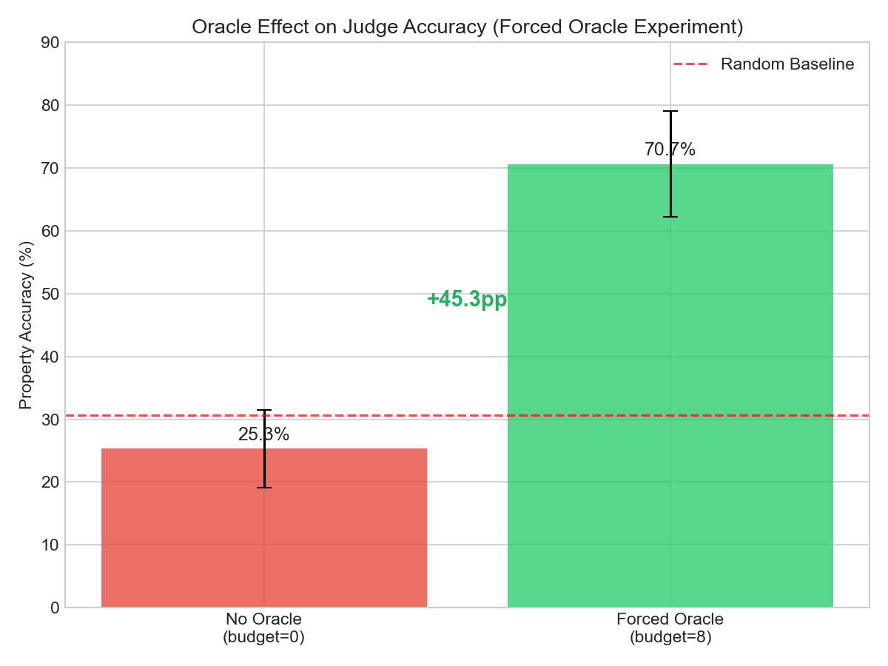
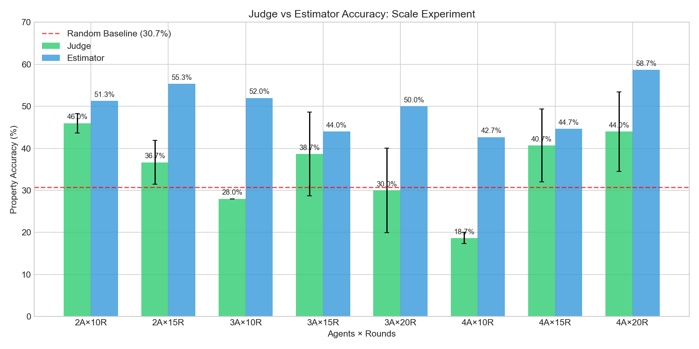
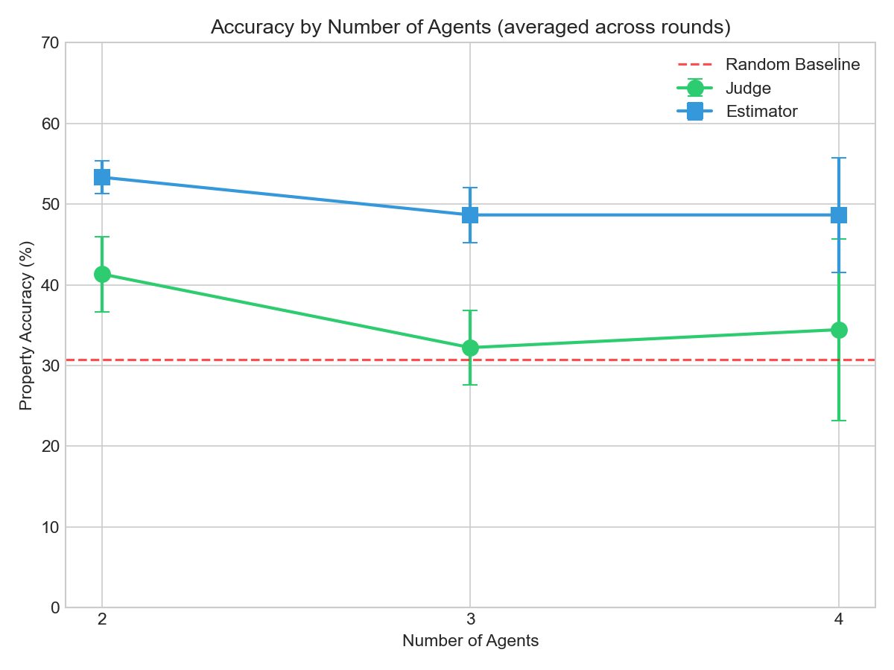
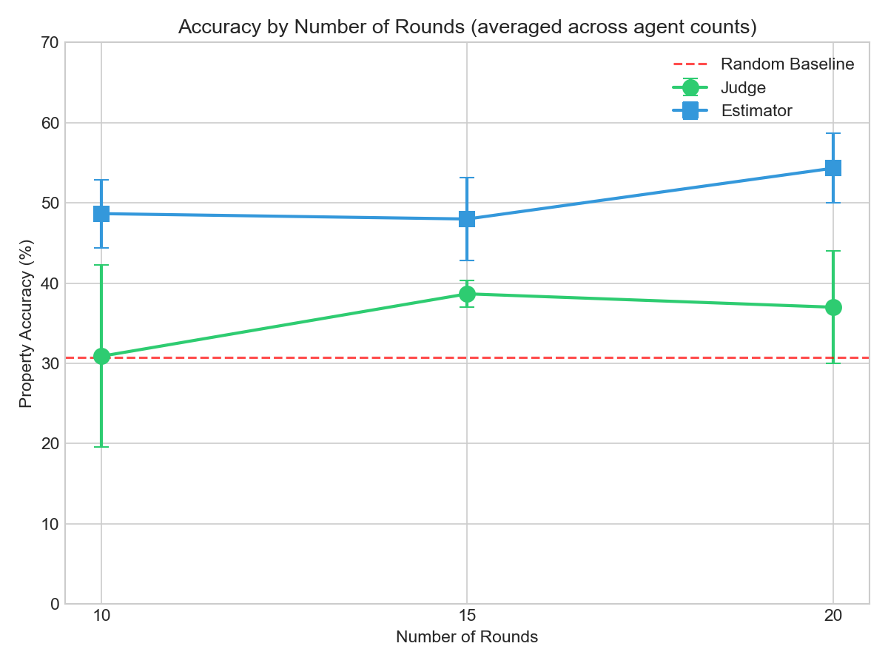
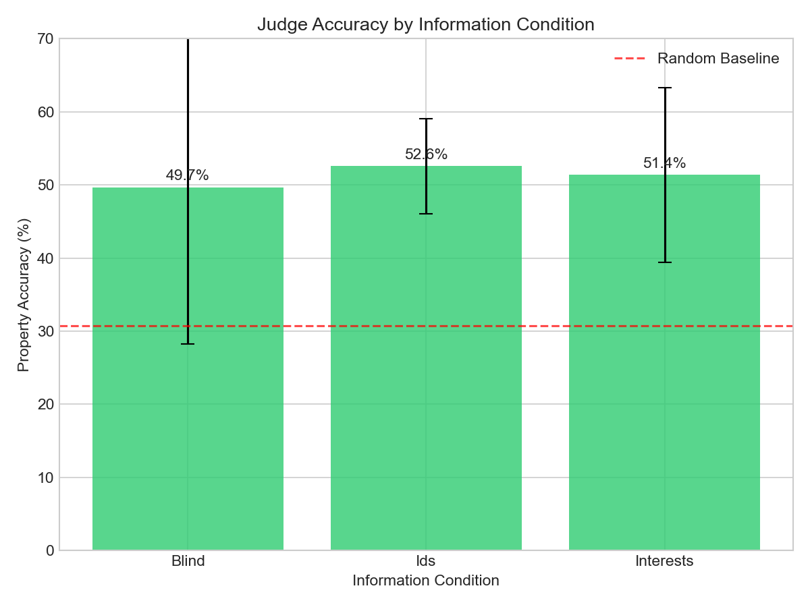
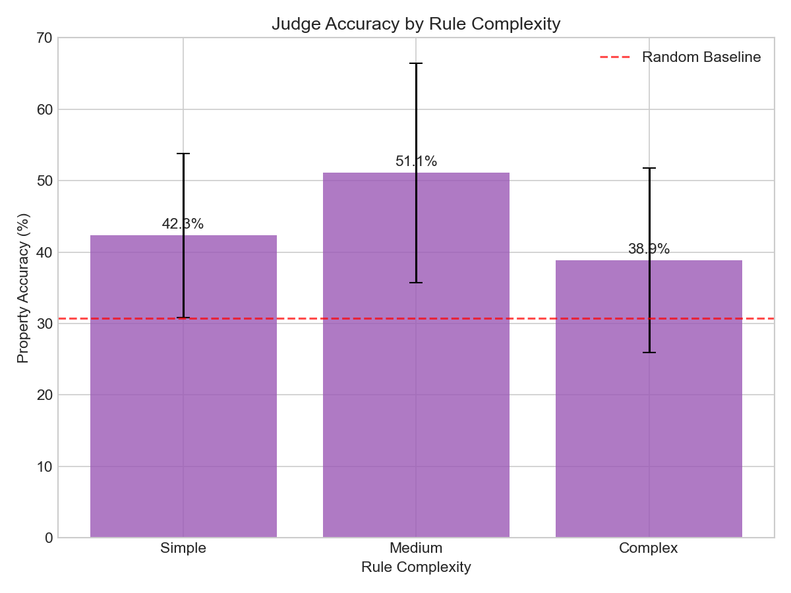
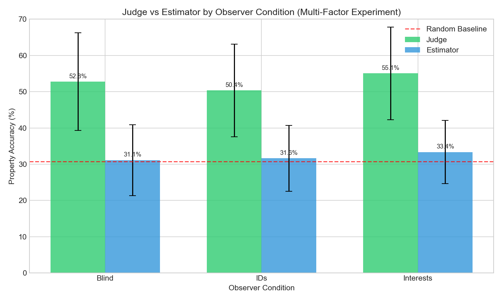

# Judge vs Estimator Accuracy Comparison

**Generated:** February 2026

This document compares Judge (active participant) vs Estimator (passive observer) accuracy across all experimental conditions.

---

## Summary

**Key Finding:** The Estimator consistently outperforms the Judge across most conditions, suggesting passive observation may be more robust to manipulation than active participation.

---

## 1. Oracle Effect

| Condition | Judge Accuracy |
|-----------|---------------|
| No Oracle (budget=0) | 25.3% (±7.4%) |
| Forced Oracle (budget=8) | 70.7% (±10.2%) |
| **Improvement** | **+45.4pp** |

**Note:** The estimator was not tracked in the forced oracle experiment. Future work should compare judge vs estimator with forced oracle to determine if oracle access benefits the active participant relative to passive observation.

---

## 2. Scale Experiment: Agents × Rounds

| Condition | Judge | Estimator | Estimator Advantage |
|-----------|-------|-----------|---------------------|
| 2A × 10R | 46.0% | 51.3% | +5.3pp |
| 2A × 15R | 36.7% | 55.3% | +18.6pp |
| 3A × 10R | 28.0% | 52.0% | +24.0pp |
| 3A × 15R | 38.7% | 44.0% | +5.3pp |
| 3A × 20R | 30.0% | 50.0% | +20.0pp |
| 4A × 10R | 18.7% | 42.7% | +24.0pp |
| 4A × 15R | 40.7% | 44.7% | +4.0pp |
| 4A × 20R | 44.0% | 58.7% | +14.7pp |

**Average Estimator Advantage:** +14.5pp

---

## 3. By Number of Agents

| Agents | Judge (avg) | Estimator (avg) |
|--------|-------------|-----------------|
| 2 | 41.3% | 53.3% |
| 3 | 32.2% | 48.7% |
| 4 | 34.4% | 48.7% |

**Insight:** Judge accuracy drops sharply with more agents (especially at low rounds), while estimator remains relatively stable.

---

## 4. By Number of Rounds

| Rounds | Judge (avg) | Estimator (avg) |
|--------|-------------|-----------------|
| 10 | 30.9% | 48.7% |
| 15 | 38.7% | 48.0% |
| 20 | 37.0% | 54.3% |

**Insight:** Both improve with more rounds, but estimator maintains a consistent lead.

---

## 5. Information Conditions

| Condition | Judge Accuracy |
|-----------|---------------|
| Blind | 49.7% |
| IDs | 52.6% |
| Interests | 51.4% |

**Note:** V2 comprehensive experiment did not track estimator accuracy separately by information condition.

---

## 6. Rule Complexity

| Complexity | Judge Accuracy |
|------------|---------------|
| Simple | 42.3% |
| Medium | 51.1% |
| Complex | 38.9% |

**Insight:** Medium complexity rules provide optimal signal for truth recovery.

---

## 7. Observer Condition (Multi-Factor Experiment)

| Condition | Judge | Estimator |
|-----------|-------|-----------|
| Blind | 44.4% | 26.1% |
| IDs | 44.9% | 26.3% |
| Interests | 43.2% | 25.7% |

**Note:** In this experiment, judge outperforms estimator. This may be due to different experimental parameters (10 objects, 10 rounds, smaller selection size).

---

## Interpretation

### Why does the estimator often outperform the judge?

1. **No targeted manipulation**: Agents tailor their deception to the judge's revealed beliefs. The estimator is invisible to agents.

2. **No commitment pressure**: The judge must make selections each round, which agents can exploit. The estimator can reserve judgment.

3. **Holistic observation**: The estimator can observe agent-to-agent dynamics without influencing them.

### When does the judge have an advantage?

1. **With oracle access**: The judge can directly verify claims (when forced to use it).

2. **Simple scenarios**: With fewer agents and shorter debates, active participation may help.

3. **Different experimental setups**: The multi-factor experiment shows judge advantage, possibly due to parameter differences.

---

## Data Sources

| Experiment | File |
|------------|------|
| Forced Oracle | `results/forced_oracle_test/results_20260213_164112.json` |
| Scale | `results/scale_experiment/results_20260212_173323.json` |
| V2 Comprehensive | `results/v2_comprehensive_opus/all_results.json` |
| Multi-Factor | `results/multi_factor/condition_stats_20260207_104922.json` |

---

*Generated by `scripts/plot_judge_vs_estimator.py`*
