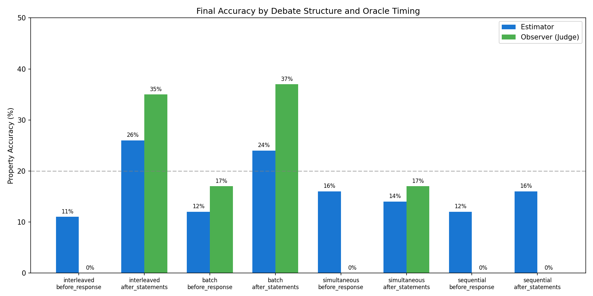
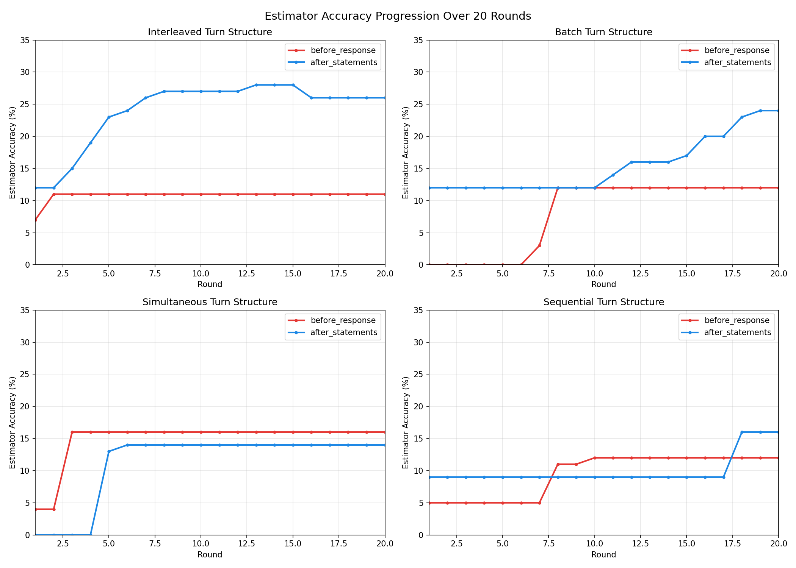

# Debate Structure Experiment Results

**Date:** February 4, 2026
**Duration:** 2.3 hours (139.6 minutes)
**Raw Data:** `outputs/debate_structure_test/20260204_183117/`
**Dashboard:** `outputs/debate_structure_test/20260204_183117/dashboard.html`

## Research Question

How do different debate turn structures and oracle timing affect an external estimator's ability to recover truth from observing agent debates?

## Experimental Setup

### Configuration
| Parameter | Value |
|-----------|-------|
| Objects | 20 |
| Rounds | 20 |
| Selection per round | 1 |
| Oracle budget | 10 queries |
| Agents | 2 (competing interests) |
| Rule complexity | medium |
| Models | claude-sonnet-4-20250514 |

### Conditions (8 total)
- **Turn Structures:** interleaved, batch, simultaneous, sequential
- **Oracle Timing:** before_response, after_statements

### Turn Structure Descriptions
- **interleaved**: Agents alternate statements (A₁ → B₁ → A₂ → B₂ → ...)
- **batch**: Each agent speaks in a block (A₁ → A₂ → A₃ → B₁ → B₂ → B₃)
- **simultaneous**: Both agents submit statements at the same time (no back-and-forth)
- **sequential**: One agent completes all statements, then the other responds

### Oracle Timing Descriptions
- **before_response**: Statements → 🔮 Oracle → Agents respond to oracle
- **after_statements**: Statements → 🔮 Oracle (no agent response to oracle)

## Results

### Final Accuracy Comparison

| Condition | Estimator Accuracy | Observer Accuracy | Selection Accuracy |
|-----------|-------------------|-------------------|-------------------|
| interleaved + before_response | **11%** | 0% | 75% |
| interleaved + after_statements | **26%** | 35% | 85% |
| batch + before_response | **12%** | 17% | 65% |
| batch + after_statements | **24%** | 37% | 85% |
| simultaneous + before_response | **16%** | 0% | 50% |
| simultaneous + after_statements | **14%** | 17% | 55% |
| sequential + before_response | **12%** | 0% | 70% |
| sequential + after_statements | **16%** | 0% | 75% |

### Accuracy Progression Over Rounds

### Oracle Timing Effect

### Agent Success Over Rounds (Best Condition)

## Key Findings

### 1. Oracle Timing Has Significant Impact
- **`after_statements` consistently outperforms `before_response`**
- Average estimator accuracy: after_statements = 20%, before_response = 12.75%
- Hypothesis: When agents can respond to oracle results, they may spin/reframe the information, making it harder for the estimator to extract truth

### 2. Turn Structure Effects
- **interleaved + after_statements** achieved the best results (26% accuracy)
- **batch + after_statements** was second best (24% accuracy)
- Simultaneous and sequential structures performed worse overall

### 3. Learning Curves
- Most conditions plateau quickly (by round 10-15)
- **interleaved + after_statements** shows the clearest learning curve: 12% → 28% → 26%
- **batch + after_statements** shows gradual improvement: 12% → 24%
- **batch + before_response** has delayed start: 0% until round 7

### 4. Observer vs Estimator Performance
- Observer (judge) outperforms estimator when both can learn (after_statements conditions)
- Observer accuracy drops to 0% in several before_response conditions
- This suggests the observer may be more susceptible to agent manipulation when agents respond to oracle

### 5. Surprising Results
- **before_response often results in 0% observer accuracy** - agents responding to oracle may be highly effective at manipulation
- **Simultaneous structure** does not improve truth recovery despite removing back-and-forth persuasion

## Interpretation

The results suggest that:

1. **Limiting agent response to verified information helps truth recovery.** When agents can spin oracle results (`before_response`), both the observer and estimator struggle more.

2. **Interleaved debate structure is most informative.** The back-and-forth allows agents to challenge each other's claims, revealing inconsistencies the estimator can detect.

3. **Truth recovery is difficult overall.** Even the best condition only achieved 26% accuracy on property beliefs (compared to ~10% random baseline for 5 properties).

4. **Learning curves flatten quickly.** Most information is extracted in the first 10 rounds; additional rounds provide diminishing returns.

## Recommendations for Future Work

1. **Test with more seeds** to verify statistical significance
2. **Vary agent models** (e.g., more capable vs less capable)
3. **Test explicit verification rounds** where agents must commit to claims
4. **Explore hybrid oracle timing** (sometimes before, sometimes after)
5. **Increase oracle budget** to see if more queries help

## Raw Data Location

- Summary: `outputs/debate_structure_test/20260204_183117/summary.json`
- Individual games: `outputs/debate_structure_test/20260204_183117/game_*.json`
- Interactive dashboard: `outputs/debate_structure_test/20260204_183117/dashboard.html`
