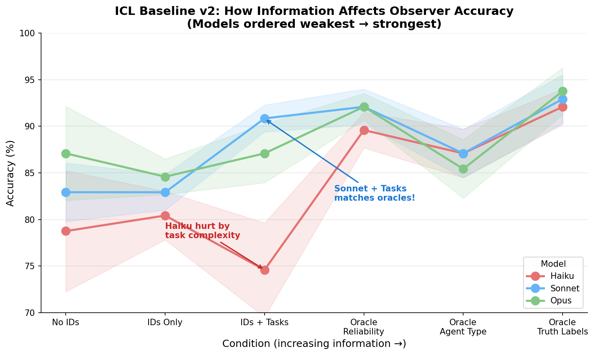
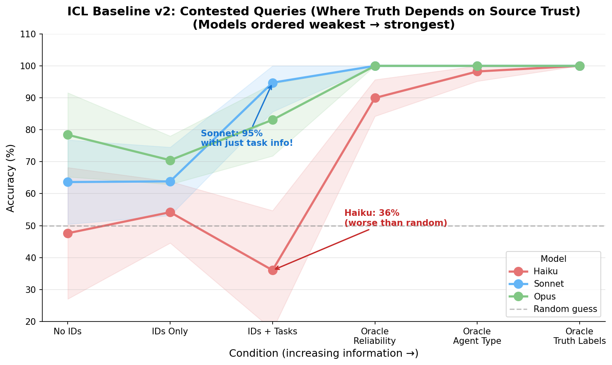
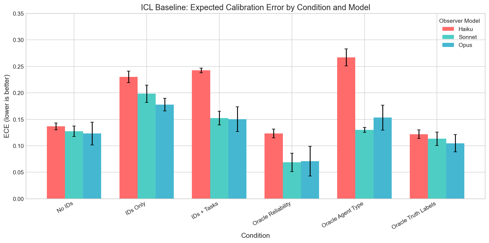
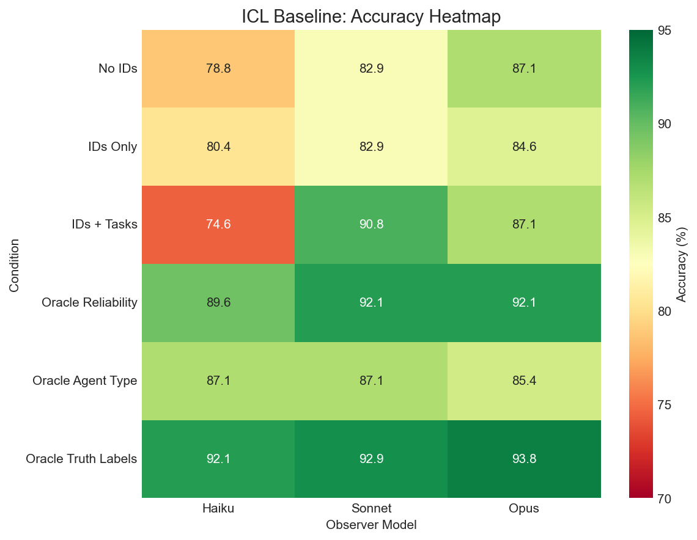

# ICL Baseline Experiment: Isolated-Query

**Date**: January 2026
**Config**: `configs/experiment/icl_baseline.yaml`
**Script**: `experiments/run_icl.py`
**Wandb**: [truthification project](https://wandb.ai/thomasjiralerspong/truthification)

## Research Question

Can LLM observers determine ground truth from potentially unreliable agent reports when they only see statements about the queried object/property?

## Experimental Setup

### World Configuration
- **20 objects** with 4 properties each
- Properties: color (5 values), shape (4 values), size (3 values), value (1-10)

### Agent Configuration
- **3 agents** with different tasks:
  - `collect_red`: interested in color
  - `collect_valuable`: interested in value
  - `find_large`: interested in size
- **50% adversarial fraction**: ~1-2 agents have false beliefs
- **80 statements per agent** = 240 total statements

### Observer Task
- **"find red circles"**: Observer cares about color and shape properties

### Key Design Innovation
Adversarial agents have **consistent false world models** about observer-relevant properties (color, shape) but tell truth about irrelevant properties (size, value). This creates detectable patterns.

## Conditions Tested

| Condition | Description |
|-----------|-------------|
| `no_ids` | Anonymous statements |
| `ids_only` | Statements with agent IDs |
| `ids_and_tasks` | IDs + task descriptions |
| `oracle_reliability` | IDs + reliability percentages |
| `oracle_agent_type` | IDs + cooperative/deceptive labels |
| `oracle_truth_labels` | IDs + TRUE/FALSE per statement |

## Results

### Overall Accuracy

| Condition | Haiku | Sonnet | Opus |
|-----------|-------|--------|------|
| no_ids | 78.8% | 83.0% | 87.1% |
| ids_only | 80.4% | 83.0% | 84.6% |
| ids_and_tasks | 74.6% | **90.8%** | 87.1% |
| oracle_reliability | 89.6% | 91.7% | 92.1% |
| oracle_truth | 91.7% | 92.9% | 93.8% |

### Accuracy by Condition

### Contested Accuracy (Hard Cases)

Contested queries are where agents disagree. This is where reliability inference matters most.

### Calibration (ECE)

Lower ECE = better calibrated confidence scores.

### Accuracy Heatmap

## Key Findings

1. **Sonnet achieves 90.8% with task info** - nearly matching oracle_truth (92.9%)
   - Can infer: "agent collecting red objects claiming something isn't red = probably lying"

2. **Task information is crucial for Sonnet** but not for other models
   - Haiku: 74.6% (worse than no_ids)
   - Opus: 87.1% (same as no_ids)

3. **Opus is most robust** across conditions without oracle info

4. **Oracle reliability provides diminishing returns** over task inference for Sonnet

## Interpretation

Sonnet demonstrates sophisticated task-based reasoning: understanding that an agent's task creates incentives that affect their reliability on different properties. This approaches the theoretical ceiling set by oracle conditions.
