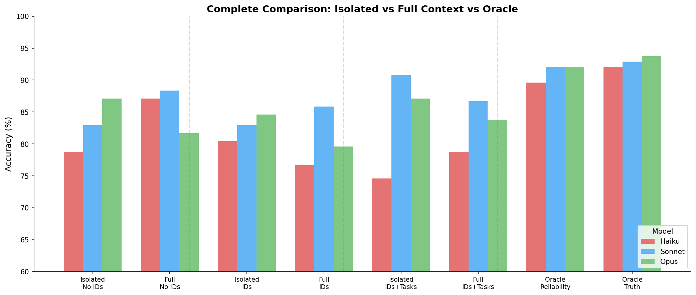

# ICL Full-Context Experiment

**Date**: January 2026
**Config**: `configs/experiment/icl_full_context.yaml`
**Script**: `experiments/run_icl_full_context.py`
**Wandb**: [truthification project](https://wandb.ai/thomasjiralerspong/truthification)

## Research Question

Does providing the observer with ALL statements (full context) enable better reliability inference through consistency pattern detection?

## Experimental Setup

### Key Difference from Baseline
- **Baseline (isolated)**: Observer sees only statements about the queried object/property
- **Full-context**: Observer sees ALL 240 statements for EVERY query

### Hypothesis
With full context, observers can:
1. See that Agent_A contradicts Agent_B and Agent_C on color/shape
2. Notice Agent_A is consistent with others on size/value
3. Infer Agent_A is unreliable on observer-relevant properties
4. Discount Agent_A's claims about color/shape

### Conditions Tested
- `full_context_no_ids`: All statements, no agent attribution
- `full_context_ids`: All statements with agent IDs
- `full_context_ids_tasks`: All statements with IDs and task descriptions

## Results

### Isolated vs Full Context Comparison

### Effect of Full Context (Delta from Baseline)

| Model | No IDs | IDs Only | IDs+Tasks |
|-------|--------|----------|-----------|
| Haiku | **+8.3pp** | -3.8pp | +4.2pp |
| Sonnet | +5.4pp | +2.9pp | **-4.2pp** |
| Opus | **-5.4pp** | -5.0pp | -3.3pp |

### Complete Comparison (All Conditions)

## Key Findings

### 1. Haiku Benefits Most from Full Context
- +8.3 percentage points with No IDs (78.8% → 87.1%)
- Full context provides simple counting heuristics
- Smaller models may use simpler, more robust strategies

### 2. Opus Degrades with Full Context
- -5.4 percentage points with No IDs (87.1% → 81.7%)
- Possible "lost in the middle" effect with 240 statements
- May overthink or find spurious patterns

### 3. Sonnet's Task Advantage Disappears
- Isolated with tasks: 90.8%
- Full context with tasks: 86.7% (-4.2pp)
- Extra context adds noise that interferes with task-based reasoning

### 4. Full Context + No IDs Often Best
- Haiku: 87.1% (best non-oracle)
- Consistency patterns more valuable than structured attribution

## Interpretation

The results suggest a complexity-capability tradeoff:
- **Smaller models (Haiku)**: Benefit from more data to find simple patterns
- **Larger models (Opus)**: May overfit to noise in large contexts
- **Mid-size models (Sonnet)**: Structured information (tasks) more valuable than raw volume

This has implications for prompt design: more context isn't always better, and the optimal amount may vary by model size.
