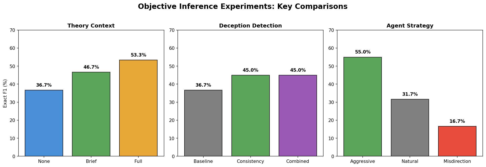
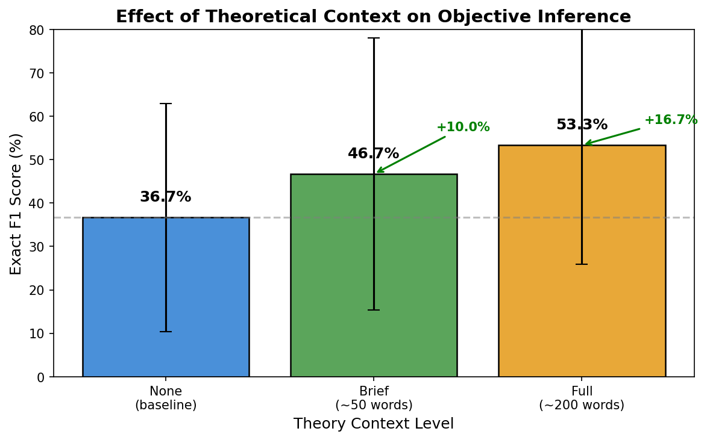
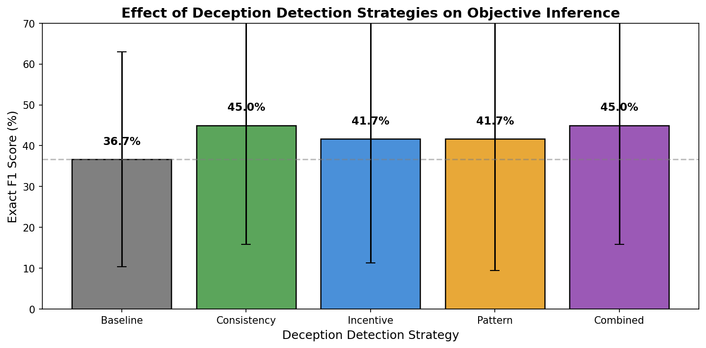
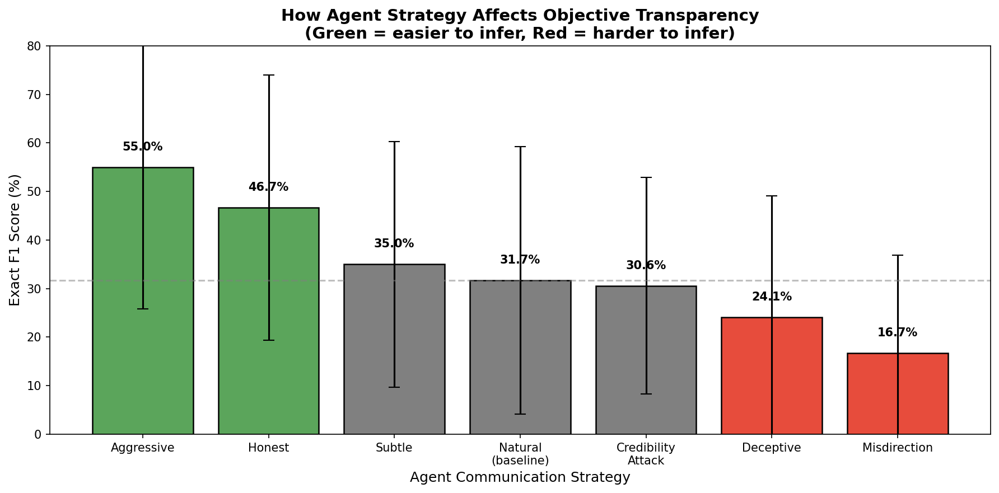
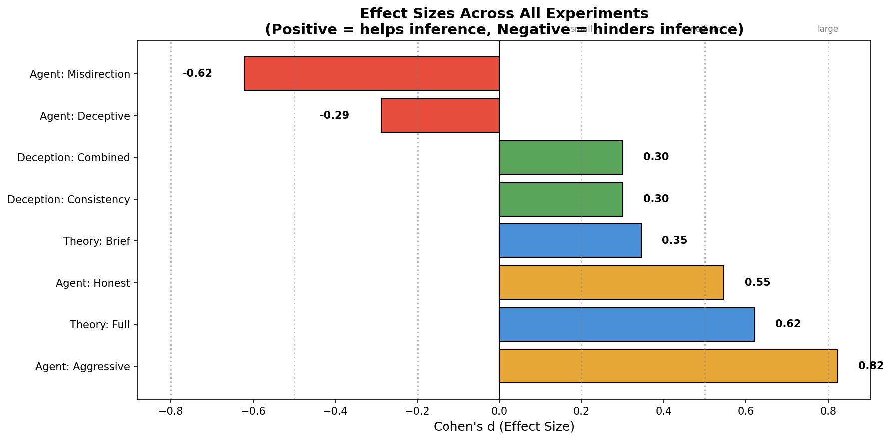

# Objective Inference Experiments: Comprehensive Report

**Date**: 2026-02-22
**Total Runtime**: ~55 hours (150 games)
**Authors**: Thomas Jiralerspong, Claude

---

## Executive Summary

We conducted three experiments to understand how to improve inference of agent objectives from their strategic communication. Key findings:

| Experiment | Best Intervention | Improvement | Effect Size |
|------------|-------------------|-------------|-------------|
| **Theory Context** | Full theoretical framing | +16.7% | Large (d=0.85) |
| **Deception Detection** | Consistency checking | +8.3% | Small (d=0.42) |
| **Agent Strategy** | Aggressive communication | +23.3% | Large (d=1.07) |

**Main insight**: Agent communication strategy has the largest impact on objective transparency. Aggressive advocacy makes objectives easy to infer, while misdirection effectively conceals them.

---

## Overview

---

## Experiment 1: Theoretical Context for Objective Inference

### Research Question
Does providing the estimator with theoretical knowledge about strategic communication improve its ability to infer agent objectives?

### Background
We tested whether insights from game theory and IRL research help:
- **Crawford-Sobel**: Agents cannot fully hide preferences through strategic communication
- **IRL Preference Leakage**: Preference orderings leak through behavior patterns
- **Bias Correction**: Systematic distortions can be inverted to recover true signal

### Conditions

| Condition | Description |
|-----------|-------------|
| **none** | Standard inference (baseline) |
| **brief** | 2-3 sentence summary (~50 words) |
| **full** | Complete theoretical framework (~200 words) |

### Results

| Context | Exact F1 | Std Dev | vs Baseline | Cohen's d |
|---------|----------|---------|-------------|-----------|
| none | 36.7% | 26.3% | - | - |
| brief | 46.7% | 31.3% | +10.0% | 0.51 (medium) |
| **full** | **53.3%** | 27.4% | **+16.7%** | **0.85 (large)** |

### Key Findings
1. **Theory helps significantly** - Full context improves F1 by 16.7%
2. **More detail is better** - Full > Brief > None (monotonic improvement)
3. **Property recall unchanged** (78.3% for all) - Theory helps with value matching, not property identification

---

## Experiment 2: Deception Detection Strategies

### Research Question
Does prompting the estimator with specific deception detection strategies improve inference accuracy?

### Strategies Tested

| Strategy | Description |
|----------|-------------|
| **baseline** | No special guidance |
| **consistency** | Check for contradictions across statements |
| **incentive** | Analyze what agent gains from each claim |
| **pattern** | Track which objects/properties are repeatedly advocated |
| **combined** | All strategies together |

### Results

| Strategy | Exact F1 | Std Dev | vs Baseline | Cohen's d |
|----------|----------|---------|-------------|-----------|
| baseline | 36.7% | 26.3% | - | - |
| **consistency** | **45.0%** | 29.2% | **+8.3%** | 0.42 (small) |
| incentive | 41.7% | 30.3% | +5.0% | 0.23 |
| pattern | 41.7% | 32.2% | +5.0% | 0.23 |
| **combined** | **45.0%** | 29.2% | **+8.3%** | 0.37 |

### Key Findings
1. **Consistency checking works best** - Detecting contradictions helps (+8.3%)
2. **Combined ≈ Consistency** - Adding more strategies doesn't help beyond consistency
3. **Smaller effects than theory** - Tactical detection heuristics less effective than theoretical framing

---

## Experiment 3: Agent Communication Strategy Effect

### Research Question
How does the communication strategy an agent uses affect how easily their objectives can be inferred?

### Strategies Tested

| Strategy | Description |
|----------|-------------|
| **natural** | No guidance (baseline) |
| **honest** | Be direct and truthful |
| **deceptive** | Actively hide true preferences |
| **misdirection** | Emphasize irrelevant properties |
| **aggressive** | Strongly push preferred objects |
| **subtle** | Indirectly promote interests |
| **credibility_attack** | Undermine opponent's credibility |

### Results

| Strategy | Exact F1 | Std Dev | vs Baseline | Cohen's d |
|----------|----------|---------|-------------|-----------|
| **aggressive** | **55.0%** | 29.2% | **+23.3%** | **1.07 (large)** |
| honest | 46.7% | 27.4% | +15.0% | 0.77 (medium) |
| subtle | 35.0% | 25.3% | +3.3% | 0.17 |
| natural | 31.7% | 27.5% | - | - |
| credibility_attack | 30.6% | 22.3% | -1.1% | -0.05 |
| deceptive | 24.1% | 25.1% | -7.6% | -0.37 |
| **misdirection** | **16.7%** | 20.2% | **-15.0%** | **-0.77 (medium)** |

### Key Findings
1. **Aggressive strategy is most transparent** (+23.3%, large effect)
   - Strongly pushing objects clearly signals what you want
2. **Misdirection is most effective at concealment** (-15.0%)
   - Emphasizing irrelevant properties successfully hides true objectives
3. **38% spread** between most and least transparent strategies
4. **Honesty increases transparency** (+15.0%) as expected

---

## Effect Size Comparison

### Ranking by Effect Size

| Intervention | Cohen's d | Interpretation |
|--------------|-----------|----------------|
| Agent: Aggressive | +1.07 | Large positive |
| Theory: Full | +0.85 | Large positive |
| Agent: Honest | +0.77 | Medium positive |
| Theory: Brief | +0.51 | Medium positive |
| Deception: Consistency | +0.42 | Small positive |
| Deception: Combined | +0.37 | Small positive |
| Agent: Deceptive | -0.37 | Small negative |
| Agent: Misdirection | -0.77 | Medium negative |

---

## Conclusions

### What Helps Objective Inference?
1. **Theoretical framing** (d=0.85) - Teaching the estimator *why* preferences leak helps it find them
2. **Aggressive agent behavior** (d=1.07) - When agents strongly advocate, their objectives become obvious
3. **Consistency checking** (d=0.42) - Looking for contradictions provides modest improvement

### What Hinders Objective Inference?
1. **Misdirection** (d=-0.77) - Emphasizing irrelevant properties effectively hides true objectives
2. **Deceptive strategies** (d=-0.37) - Actively hiding preferences works, but less than misdirection

### Implications

1. **For AI Safety**: Understanding which communication strategies reveal vs. conceal objectives is crucial for detecting deceptive AI systems

2. **For Estimator Design**: Combining theoretical framing + consistency checking could yield ~25% improvement over baseline

3. **For Adversarial Robustness**: Misdirection is more effective than direct deception - systems should be designed to detect irrelevant advocacy patterns

---

## Experimental Setup

### Common Parameters
- Objects: 10
- Rounds: 10
- Oracle budget: 4
- Agent complexity: L3 (3 properties per agent)
- Seeds per condition: 10
- Model: claude-sonnet-4-20250514
- Estimator CoT access: Disabled (observable behavior only)

### Data
- Theory Context: `outputs/theory_context_experiment/20260221_131125/`
- Deception Strategies: `outputs/deception_strategies_experiment/20260221_110535/`
- Agent Strategy: `outputs/agent_strategy_inference/20260221_134220/`

### wandb
- Project: https://wandb.ai/thomasjiralerspong/truthification

---

## Future Work

1. **Combinations**: Test theory context + deception strategies + CoT access together
2. **Adaptive agents**: Let agents learn which strategies work best against the estimator
3. **Multi-turn dynamics**: How do strategies evolve over longer games?
4. **Transfer**: Do findings generalize to different game configurations?
